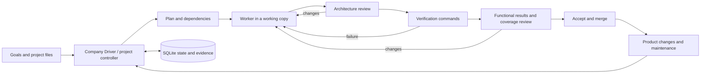

# Miner — Switch Studio

A self-hosted web IDE and workflow manager for building and maintaining digital products with AI agents.

**Status: `0.4.0-alpha.7` · experimental · macOS / Linux / Windows via WSL2**

Miner is the repository name; the application is called **Switch Studio**. It provides
a browser interface, persistent project workflows and a Company Builder & Driver. The interface, built-in instructions and Studio documentation are in English.
Question-mark help beside controls explains their purpose, use and a concrete example.
Existing user-authored task briefs and history keep their original language.

## What it does

- Open directly to a live dashboard: running work, queued tasks, owner decisions and company status.
- Assign a task from the dashboard with a project, department or model, instructions and completion criteria.

- Edit project files, inspect outputs and follow real tool activity in a browser.
- Use an OpenAI-compatible model endpoint, including a local Ollama server.
- Run single-agent ReAct or Agent Team workflows.
- Plan a project, execute tasks, request a separate model review and run explicit verification commands.
- Keep task dependencies, questions, evidence, attempt limits and recovery state in SQLite.
- Organize projects and recurring work through Company Builder & Driver.
- Follow work and blockers on a live dependency diagram or the interactive **3D Office**.
- Select a department desk to inspect real status, the latest model run and its blockers.
- Track product versions, stage changes in a working copy and manage optional local services and repair queues.
- Keep project knowledge in ordinary Markdown files, starting with `PROJECT.md`.

The Company Driver currently shares **one worker slot** across managed tasks. A department is
an instruction context, not an isolated service account. A role template is not a fleet of
30 simultaneous workers. Running a real company autonomously for a week has not been validated.

## Downloads

Download the macOS, Linux or Windows/WSL2 source package from
[GitHub Releases](https://github.com/RulezZzOr/miner/releases). Each release includes
SHA-256 checksums. Packages contain launchers and source code; setup downloads Python
and locked dependencies. They do not include model weights.

## Quick start

Install [uv](https://docs.astral.sh/uv/getting-started/installation/) and Git, then:

```sh
git clone https://github.com/RulezZzOr/miner.git
cd miner
sh setup-studio
sh switch-studio --no-open
```

Open **http://127.0.0.1:4317**. In **More → Models**, configure a reachable model endpoint and a model
that is actually available on it. The supplied model name is a placeholder; no model weights
or paid provider account are included. The installer downloads Python 3.12 and locked dependencies.

Windows users run the backend inside WSL2; see [installation instructions](INSTALL.md).
There is no native Windows executable or signed macOS installer in this alpha.
Closing the browser does not stop the server; stopping the server stops its active workers.

## How work moves



A model saying “done” is not sufficient to pass independent verification. The selected checks
still determine what is verified; they cannot prove properties they do not test.

## Current boundaries

- Native agent commands run with the host user's permissions. A working copy is not an OS sandbox.
- The web server has no user login or per-user access control. Use loopback or a trusted private
  network; do not expose it directly to the public internet.
- Tool approval and automatic result acceptance are separate settings. Limits count attempts,
  not a guaranteed monetary cap at a model provider.
- CRM, email, banking, Vapi and Buffer are not connected out of the box. The optional SSH connector
  performs explicitly configured, read-only inventory; it is not a general server administrator.
- Optional account adapters require their own local CLI setup. Availability depends on the
  provider and environment; see [Studio documentation](studio/README.md).
- Local automated checks and bounded live-model runs have been exercised on macOS and Linux.
  Windows/WSL2 end-to-end use and week-long autonomy remain unverified.
- This repository has not established benchmark parity with hosted Apodex or any particular model.

## Documentation

- [Dashboard and quick task assignment](studio/docs/DASHBOARD.md)
- [Installation and platform limits](INSTALL.md)
- [Studio features and optional accounts](studio/README.md)
- [Company Builder & Driver](studio/docs/COMPANY_DRIVER.md)
- [Project verification and recovery](studio/docs/CONTROL_LOOP.md)
- [Product lifecycle](studio/docs/PRODUCT_LIFECYCLE.md)
- [Markdown project notes](studio/docs/MARKDOWN_NOTES.md)
- [Contributing and tests](CONTRIBUTING.md)
- [Security and reporting](SECURITY.md)
- [Upstream provenance](frontier/SWITCH.md) and [third-party notices](THIRD_PARTY.md)

## Validation of this snapshot

The alpha.7 Studio backend suite ran 225 tests (224 passed, one optional test skipped);
90 frontend checks passed. Dashboard GUI checks cover queue submission, preserving task
drafts during refresh, company status and navigation to the workspace. Bounded live-model
workflows on Linux have exercised planning, file creation, independent review and acceptance.
These are scoped checks, not proof of unattended company operation.
No GitHub Actions run is claimed for this snapshot.

## License and origin

Application code: Apache-2.0; see [LICENSE](LICENSE). The bundled FrontierChallenge component
retains CC BY 4.0; see [THIRD_PARTY.md](THIRD_PARTY.md) for component-specific terms.
FrontierAgent source and attribution are retained under
`frontier/`, based on upstream commit `9e533db6f6c34d16037ee5ec964c479d0eb51cde`.
The upstream agent runtime, tools, terminal interface and evaluation framework are upstream work;
Miner adds the Studio application and integration changes. This is an independent derivative
project, not an official Apodex product.

No credentials, local company records, agent transcripts or model weights are included.

### Alpha.6: bounded reviews and decision experiments

Reviews now use immutable evidence packets with a fixed read budget and typed outcomes. Optional task selection supports Off, Shadow and Select with stale-response rejection. **Decision lab** provides read-only idea scoring, document triage and CRM routing proposals, using a local chat profile or optional TypeSafe cloud, with saved Markdown reports. See [behavior, setup and limits](studio/docs/DECISION_LAB.md).

### Alpha.7: dashboard first

The home screen shows active agents, queued company assignments and items requiring attention
across all projects. Add a task in place: select a project, company/department or standalone
model, write the brief and define “Done when”. Company tasks inherit existing worker/reviewer
and permission settings; paused Drivers keep new work queued. Standalone tasks start with
normal tool approvals and do not include independent review. More options contains constraints,
priority and verification commands or the standalone step limit. Refreshing never clears a draft.
The Workspace, 3D Office and live map remain directly accessible; secondary tools are under More.
