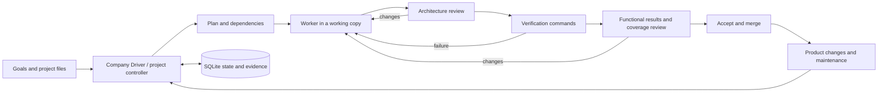

# Miner — Switch Studio

A self-hosted web IDE and workflow manager for building and maintaining digital products with AI agents.

**Status: `0.4.0-alpha.9` · experimental · macOS / Linux / Windows via WSL2**

Miner is the repository name; the application is called **Switch Studio**. It provides
a browser interface, persistent project workflows and a Company Builder & Driver. The interface, built-in instructions and Studio documentation are in English.
Question-mark help beside controls explains their purpose, use and a concrete example.
Existing user-authored task briefs and history keep their original language.

## Feature overview

Implemented capabilities in alpha.9. Optional adapters need their own setup; experimental
features are labeled. The [complete feature catalog](studio/docs/FEATURES.md) includes
usage examples, implementation references, verification and the limits of each area.

| Feature | What you can do | Guide |
| --- | --- | --- |
| **Live dashboard** | See active work, task queues, company status and decisions across projects, with freshness/offline indicators. | [Dashboard](studio/docs/DASHBOARD.md) |
| **Quick task assignment** | Pick a project, company/department or standalone model; enter instructions and completion criteria; queue or start work. | [Task entry](studio/docs/DASHBOARD.md#give-an-assignment) |
| **Interactive 3D Office** | Inspect occupied desks, departments, models and blockers; rotate, zoom, filter by company or use the accessible list. Movement follows recent recorded activity. | [3D Office](studio/docs/OFFICE.md) |
| **Live dependency map** | Follow the current execution step, actual dependencies, verification, blockers and recent events. | [Visual monitoring](studio/docs/FEATURES.md#dashboard-and-visual-monitoring) |
| **Browser workspace / IDE** | Browse project files, edit and save text, create files and inspect outputs. Conflicting edits are rejected. | [Workspace](studio/README.md#features) |
| **Local models and optional accounts** | Configure Ollama/OpenAI-compatible endpoints; optionally connect the implemented Codex or Claude Console adapters. | [Models and accounts](studio/docs/FEATURES.md#models-agents-and-tools) |
| **Single agent and Agent Team** | Run native ReAct or delegated team tasks, inspect tool events and stop the monitored process tree. | [Agent scope](studio/docs/FEATURES.md#models-agents-and-tools) |
| **Managed AI Projects** | Turn a brief into a persistent plan, tasks, questions, execution, review and acceptance. | [AI Projects](studio/docs/LONG_RUNNING_PROJECTS.md) |
| **Separate worker and reviewer** | Choose profiles for implementation and architecture/functionality review; failed checks return work for correction. | [Control loop](studio/docs/CONTROL_LOOP.md) |
| **Approvals and owner decisions** | Answer Yes / No / custom input, revise conflicting briefs, pause work and choose explicit auto-approval settings. | [Delivery workflow](studio/docs/DELIVERY_WORKFLOW.md) |
| **Verified result card** | Inspect actual command outcomes, test counts, output hashes, source freshness and acceptance limitations. | [Result evidence](studio/docs/DELIVERY_WORKFLOW.md#2-inspect-one-result-card) |
| **Readiness, process modes and handoff** | Catch recognized brief conflicts, select Light/Standard/Sensitive handling and resume from a bounded saved handoff. | [Delivery workflow](studio/docs/DELIVERY_WORKFLOW.md) |
| **Company Builder & Driver** | Manage project portfolios, departments, dependencies, priorities, recurring assignments, limits and Markdown reports. | [Company Driver](studio/docs/COMPANY_DRIVER.md) |
| **30-role AI Build Company template** | Save and customize responsibilities, instructions, reviewers and project briefs. A role template does not launch 30 agents. | [Template](studio/templates/README.md) |
| **Products and maintenance loops** | Keep permanent product criteria, queue changes, track accepted versions and optionally schedule maintenance. | [Products](studio/docs/PRODUCT_LIFECYCLE.md) |
| **Versions, merge and recovery** | Work in a copy, check source conflicts, accept changes and preview/restore recorded content versions. | [Version boundaries](studio/docs/CONTROL_LOOP.md#isolation-and-versions) |
| **Local deployment and repair queue** | Start an approved local service, check HTTP health, record incidents and optionally queue repairs or redeploy an older verified version. | [Local deployment](studio/docs/CONTROL_LOOP.md#local-deployment-and-fixes) |
| **Markdown project knowledge** | Load `PROJECT.md`; append dated acceptance summaries, decisions and output references without overwriting concurrent edits. | [Project notes](studio/docs/MARKDOWN_NOTES.md) |
| **Static web preview** | Create a starter page, preview saved HTML/CSS/JS, reload changed assets and switch to a 390 px mobile-width view. | [Preview](studio/docs/WEB_PREVIEW.md) |
| **Decision experiments** | Try bounded task selection, idea/document/CRM-text judgments and a local browser-action fixture. These are experiments, not live CRM or general browser automation. | [Decision lab](studio/docs/DECISION_LAB.md) |
| **Optional read-only SSH inventory** | Inspect explicitly configured hosts for approved missions, using key authentication and host-key verification. | [SSH setup](INSTALL.md#read-only-ssh-inventory-for-a-mission) |
| **Help, audit and distribution** | Use contextual question-mark help, English UI, local verification and macOS/Linux/Windows-WSL2 source packages. GitHub Actions is not used. | [Full catalog](studio/docs/FEATURES.md) |

The Company Driver currently shares **one worker slot** across managed tasks. A department is
an instruction context, not an isolated service account. A role template is not a fleet of
30 simultaneous workers. Running a real company autonomously for a week has not been validated.

## Downloads

Download the macOS, Linux or Windows/WSL2 source package from
[GitHub Releases](https://github.com/RulezZzOr/miner/releases). Each release includes
SHA-256 checksums. Packages contain launchers and source code; setup downloads Python
and locked dependencies. They do not include model weights.

## Quick start

Install [uv](https://docs.astral.sh/uv/getting-started/installation/) and Git, then:

```sh
git clone https://github.com/RulezZzOr/miner.git
cd miner
sh setup-studio
sh switch-studio --no-open
```

Open **http://127.0.0.1:4317**. In **More → Models**, configure a reachable model endpoint and a model
that is actually available on it. The supplied model name is a placeholder; no model weights
or paid provider account are included. The installer downloads Python 3.12 and locked dependencies.

Windows users run the backend inside WSL2; see [installation instructions](INSTALL.md).
There is no native Windows executable or signed macOS installer in this alpha.
Closing the browser does not stop the server; stopping the server stops its active workers.

## How work moves



A model saying “done” is not sufficient to pass independent verification. The selected checks
still determine what is verified; they cannot prove properties they do not test.

## Current boundaries

- Native agent commands run with the host user's permissions. A working copy is not an OS sandbox.
- The web server has no user login or per-user access control. Use loopback or a trusted private
  network; do not expose it directly to the public internet.
- Tool approval and automatic result acceptance are separate settings. Limits count attempts,
  not a guaranteed monetary cap at a model provider.
- CRM, email, banking, Vapi and Buffer are not connected out of the box. The optional SSH connector
  performs explicitly configured, read-only inventory; it is not a general server administrator.
- Optional account adapters require their own local CLI setup. Availability depends on the
  provider and environment; see [Studio documentation](studio/README.md).
- Local automated checks and bounded live-model runs have been exercised on macOS and Linux.
  Windows/WSL2 end-to-end use and week-long autonomy remain unverified.
- This repository has not established benchmark parity with hosted Apodex or any particular model.

## Documentation

- [Complete feature catalog and capability boundaries](studio/docs/FEATURES.md)
- [Dashboard and quick task assignment](studio/docs/DASHBOARD.md)
- [Interactive 3D Office](studio/docs/OFFICE.md)
- [Installation and platform limits](INSTALL.md)
- [Studio features and optional accounts](studio/README.md)
- [Company Builder & Driver](studio/docs/COMPANY_DRIVER.md)
- [Project verification and recovery](studio/docs/CONTROL_LOOP.md)
- [Product lifecycle](studio/docs/PRODUCT_LIFECYCLE.md)
- [Markdown project notes](studio/docs/MARKDOWN_NOTES.md)
- [Contributing and tests](CONTRIBUTING.md)
- [Security and reporting](SECURITY.md)
- [Delivery and security audit, 24 September 2026](docs/AUDIT-2026-09-24.md)
- [Upstream provenance](frontier/SWITCH.md) and [third-party notices](THIRD_PARTY.md)

## Validation of this snapshot

The alpha.9 runtime passed 241 backend tests (one optional test skipped) and 92
frontend checks on macOS and Linux. The [release includes verification receipts](https://github.com/RulezZzOr/miner/releases/tag/v0.4.0-alpha.9).
Alpha.9 adds attributed acceptance summaries, bounded output links and a
Markdown-escaping regression. Release receipts identify
the exact tested revision and package hashes. Dashboard GUI checks cover queue submission, preserving task
drafts during refresh, company status and navigation to the workspace. Bounded live-model
workflows on Linux have exercised planning, file creation, independent review and acceptance.
These are scoped checks, not proof of unattended company operation.
Verification runs locally and on the operator's own server. GitHub Actions is not
used or required; see [local verification](CONTRIBUTING.md#local-checks).

## License and origin

Application code: Apache-2.0; see [LICENSE](LICENSE). The bundled FrontierChallenge component
retains CC BY 4.0; see [THIRD_PARTY.md](THIRD_PARTY.md) for component-specific terms.
FrontierAgent source and attribution are retained under
`frontier/`, based on upstream commit `9e533db6f6c34d16037ee5ec964c479d0eb51cde`.
The upstream agent runtime, tools, terminal interface and evaluation framework are upstream work;
Miner adds the Studio application and integration changes. This is an independent derivative
project, not an official Apodex product.

No credentials, local company records, agent transcripts or model weights are included.

### Alpha.6: bounded reviews and decision experiments

Reviews now use immutable evidence packets with a fixed read budget and typed outcomes. Optional task selection supports Off, Shadow and Select with stale-response rejection. **Decision lab** provides read-only idea scoring, document triage and CRM routing proposals, using a local chat profile or optional TypeSafe cloud, with saved Markdown reports. See [behavior, setup and limits](studio/docs/DECISION_LAB.md).

### Alpha.7: dashboard first

The home screen shows active agents, queued company assignments and items requiring attention
across all projects. Add a task in place: select a project, company/department or standalone
model, write the brief and define “Done when”. Company tasks inherit existing worker/reviewer
and permission settings; paused Drivers keep new work queued. Standalone tasks start with
normal tool approvals and do not include independent review. More options contains constraints,
priority and verification commands or the standalone step limit. Refreshing never clears a draft.
The Workspace, 3D Office and live map remain directly accessible; secondary tools are under More.
