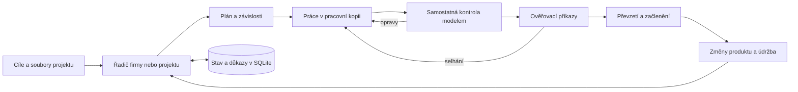

# Miner — Switch Studio

Webové vývojové prostředí a řadič pracovních postupů pro tvorbu a údržbu digitálních produktů pomocí AI agentů. Běží na vlastním počítači nebo serveru.

**Verze `0.4.0-alpha.4` · experimentální · macOS / Linux / Windows přes WSL2**

Miner je název repozitáře; aplikace se jmenuje **Switch Studio**. Rozhraní, nápovědy a vestavěné pokyny Studia jsou v češtině. Otazník u ovládacího prvku vysvětluje jeho účel, použití a příklad. Uživatelská zadání, historie, názvy modelů a původní výstupy externích nástrojů si zachovávají svůj jazyk.

## Stažení

Balíky najdete ve [vydání 0.4.0-alpha.4](https://github.com/RulezZzOr/miner/releases/tag/v0.4.0-alpha.4):

| Systém | Balík |
| --- | --- |
| macOS | [ZIP](https://github.com/RulezZzOr/miner/releases/download/v0.4.0-alpha.4/switch-studio-0.4.0-alpha.4-macos.zip) |
| Linux | [TAR.GZ](https://github.com/RulezZzOr/miner/releases/download/v0.4.0-alpha.4/switch-studio-0.4.0-alpha.4-linux.tar.gz) |
| Windows přes WSL2 | [ZIP](https://github.com/RulezZzOr/miner/releases/download/v0.4.0-alpha.4/switch-studio-0.4.0-alpha.4-windows-wsl2.zip) |

Kontrolní součty jsou v přiloženém `SHA256SUMS`. Jde o balíky zdrojového kódu se spouštěči; instalace pomocí `uv` stáhne Python a pevně určené závislosti. Nejde o samostatné `.exe`, podepsanou aplikaci `.app` ani balík s váhami modelu. Postup popisuje [INSTALL.md](INSTALL.md).

## Co aplikace umí

- Upravovat a ukládat soubory projektu, zobrazovat výstupy a skutečnou aktivitu nástrojů.
- Připojit místní model, například přes Ollamu nebo kompatibilní API; volitelně připojit podporovaný účet poskytovatele.
- Spouštět jednotlivé agenty i týmové pracovní postupy.
- Naplánovat projekt, provést úkoly, předat výsledek samostatné kontrole a spustit schválené ověřovací příkazy.
- Ukládat závislosti, otázky, důkazy, limity pokusů a stav obnovy do SQLite.
- Organizovat firmy, projekty a opakovanou práci s omezeným rozpočtem běhů.
- Zobrazovat aktivitu a překážky v živé mapě a v interaktivní **3D kanceláři**.
- Spravovat verze produktu, převzetí změn z pracovní kopie a volitelné místní služby.
- Uchovávat znalosti v běžných souborech Markdown od rozcestníku `PROJECT.md`.

Řadič firmy nyní sdílí **jedno místo pro běžícího pracovníka** mezi spravovanými úkoly. Oddělení určuje kontext pokynů; není samostatným účtem ani hranicí oprávnění. Šablona 30 rolí nespouští 30 současných pracovníků.

## Rychlé spuštění

Nainstalujte [uv](https://docs.astral.sh/uv/getting-started/installation/) a Git:

```sh
git clone https://github.com/RulezZzOr/miner.git
cd miner
sh setup-studio
sh switch-studio --no-open
```

Otevřete **http://127.0.0.1:4317**. V části **Modely** nastavte adresu dosažitelného serveru a přesný název dostupného modelu. Potom otevřete složku projektu. Při přístupu přes LAN se cesty vztahují k serveru, na kterém Studio běží.

Zavření prohlížeče práci na serveru nezastaví. Použijte **Zastavit** pro běh nebo **Pozastavit řadič** pro firmu. Zastavení serveru ukončí jeho aktivní pracovníky.

## Jak postupuje práce



3D kancelář čte stav tohoto procesu. Kliknutí na obsazený stůl otevře konkrétní úkol a odkazy na běh, schválení a živou mapu. Pohyb při práci vyžaduje nedávné události. Prázdné stoly jsou ilustrace. Agenti spolupracují přes řadič, úkoly a soubory; kancelář není další neuronová síť.

## Hranice této verze

- Nativní nástroje mají oprávnění uživatele operačního systému. Pracovní kopie není izolace operačního systému.
- Studio nemá přihlášení pro více uživatelů. Používejte místní adresu nebo důvěryhodnou soukromou síť; port nevystavujte přímo internetu.
- Schvalování nástrojů a automatické převzetí výsledku jsou samostatná nastavení. Rozpočet běhů nezaručuje finanční limit poskytovatele.
- CRM, e-mail, bankovnictví, Vapi ani Buffer nejsou automaticky připojeny. Volitelný SSH konektor poskytuje předem nastavenou inventarizaci pouze pro čtení.
- Účty poskytovatelů vyžadují vlastní konfiguraci. Jejich přihlášení nelze ověřit testem místního modelu.
- Celý provoz ve Windows/WSL2 a týdenní autonomní řízení skutečné firmy nebyly ověřeny. Výsledky modelu je nutné posuzovat podle uložených souborů a kontrol.

## Dokumentace a ověření

- [Instalace](INSTALL.md) · [Funkce a účty](studio/README.md)
- [Řízení firmy](studio/docs/COMPANY_DRIVER.md) · [Pracovní smyčka](studio/docs/CONTROL_LOOP.md)
- [3D kancelář](studio/docs/OFFICE.md) · [Ruční kontrola instalace](studio/docs/TESTING.md)
- [Životní cyklus produktu](studio/docs/PRODUCT_LIFECYCLE.md) · [Poznámky v Markdownu](studio/docs/MARKDOWN_NOTES.md)
- [Testy a přispívání](CONTRIBUTING.md) · [Bezpečnost](SECURITY.md)

Automatizované testy ověřují mechanismy ukládání, schvalování, řízení práce a rozhraní. Čistou instalaci ověřuje `scripts/smoke_release.py`. Konkrétní rozsah ověření uvádějí poznámky u vydání. Úspěšné testy neznamenají záruku bezchybného nebo nepřetržitého provozu firmy.

## Licence a původ

Aplikační kód používá Apache-2.0; viz [LICENSE](LICENSE). Součást FrontierChallenge zachovává CC BY 4.0; viz [THIRD_PARTY.md](THIRD_PARTY.md).

Složka `frontier/` obsahuje upravený FrontierAgent na základě upstream commitu `9e533db6f6c34d16037ee5ec964c479d0eb51cde`, včetně původních licencí a uvedení autorů. Dodává běhové prostředí agentů, nástroje, terminálové rozhraní a vyhodnocovací rámec. Miner přidává Studio a integrační změny. Jde o nezávislý odvozený projekt, nikoli oficiální produkt Apodex. [Přehled změn](frontier/SWITCH.md).

Distribuce neobsahuje přihlašovací údaje, soukromé firemní záznamy, přepisy agentů ani váhy modelů.
