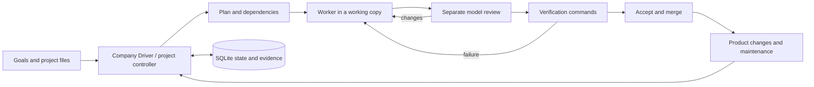

# Miner — Switch Studio

A self-hosted web IDE and workflow manager for building and maintaining digital products with AI agents.

**Status: `0.4.0-alpha.1` · experimental · macOS / Linux / Windows via WSL2**

Miner is the repository name; the application is called **Switch Studio**. It provides
a browser interface, persistent project workflows and a Company Builder & Driver. The current interface and most
Studio documentation are in Czech; the backend and upstream documentation are in English.

## What it does

- Edit project files, inspect outputs and follow real tool activity in a browser.
- Use an OpenAI-compatible model endpoint, including a local Ollama server.
- Run FrontierAgent's single-agent ReAct or Agent Team workflows.
- Plan a project, execute tasks, request a separate model review and run explicit verification commands.
- Keep task dependencies, questions, evidence, attempt limits and recovery state in SQLite.
- Organize projects and recurring work through Company Builder & Driver.
- Follow work and blockers on a live dependency diagram.
- Track product versions, stage changes in a working copy and manage optional local services and repair queues.
- Keep project knowledge in ordinary Markdown files, starting with `PROJECT.md`.

The Company Driver currently shares **one worker slot** across managed tasks. A department is
an instruction context, not an isolated service account. A role template is not a fleet of
30 simultaneous workers. Running a real company autonomously for a week has not been validated.

## Quick start

Install [uv](https://docs.astral.sh/uv/getting-started/installation/) and Git, then:

```sh
git clone https://github.com/RulezZzOr/miner.git
cd miner
sh setup-studio
sh switch-studio --no-open
```

Open **http://127.0.0.1:4317**. In **Modely**, configure a reachable model endpoint and a model
that is actually available on it. The supplied model name is a placeholder; no model weights
or paid provider account are included. The installer downloads Python 3.12 and locked dependencies.

Windows users run the backend inside WSL2; see [installation instructions](INSTALL.md).
There is no native Windows executable or signed macOS installer in this alpha.
Closing the browser does not stop the server; stopping the server stops its active workers.

## How work moves



A model saying “done” is not sufficient to pass independent verification. The selected checks
still determine what is verified; they cannot prove properties they do not test.

## Current boundaries

- Native agent commands run with the host user's permissions. A working copy is not an OS sandbox.
- The web server has no user login or per-user access control. Use loopback or a trusted private
  network; do not expose it directly to the public internet.
- Tool approval and automatic result acceptance are separate settings. Limits count attempts,
  not a guaranteed monetary cap at a model provider.
- CRM, email, banking, Vapi and Buffer are not connected out of the box. The optional SSH connector
  performs explicitly configured, read-only inventory; it is not a general server administrator.
- Optional account adapters require their own local CLI setup. Availability depends on the
  provider and environment; see [Studio documentation](studio/README.md).
- Local automated checks and bounded live-model runs have been exercised on macOS and Linux.
  Windows/WSL2 end-to-end use and week-long autonomy remain unverified.
- This repository has not established benchmark parity with hosted Apodex or any particular model.

## Documentation

- [Installation and platform limits](INSTALL.md)
- [Studio features and optional accounts](studio/README.md)
- [Company Builder & Driver](studio/docs/COMPANY_DRIVER.md)
- [Project verification and recovery](studio/docs/CONTROL_LOOP.md)
- [Product lifecycle](studio/docs/PRODUCT_LIFECYCLE.md)
- [Markdown project notes](studio/docs/MARKDOWN_NOTES.md)
- [Contributing and tests](CONTRIBUTING.md)
- [Security and reporting](SECURITY.md)
- [Upstream provenance](frontier/SWITCH.md) and [third-party notices](THIRD_PARTY.md)

## Validation of this snapshot

Before initial publication: the Studio backend suite ran 165 tests (164 passed, one skipped);
48 frontend checks passed. A clean macOS source-archive install started the HTTP server,
returned HTTP 200 and shut down gracefully. These are scoped checks, not proof of
unattended company operation. No GitHub Actions run is claimed for this snapshot.

## License and origin

Apache-2.0; see [LICENSE](LICENSE). FrontierAgent source and attribution are retained under
`frontier/`, based on upstream commit `9e533db6f6c34d16037ee5ec964c479d0eb51cde`.
The upstream agent runtime, tools, terminal interface and evaluation framework are upstream work;
Miner adds the Studio application and integration changes. This is an independent derivative
project, not an official Apodex product.

No credentials, local company records, agent transcripts or model weights are included.
