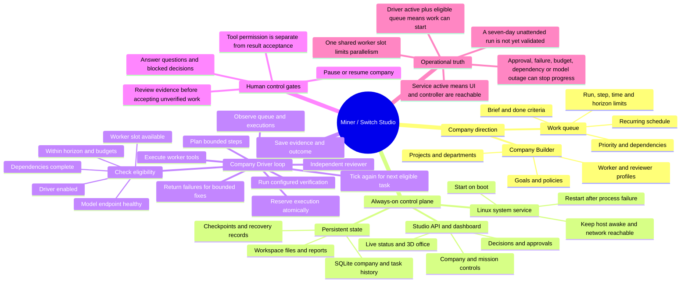

# Miner — 24/7 company mind map

Miner (Switch Studio) is a persistent work controller for an AI-run company. Its always-on web service makes the control plane available; the Company Driver schedules eligible work while its configured limits and human decision gates allow it. A running server alone does not mean agents are currently working.

## What must be true for continuous work

1. The host boots the Studio service and automatically restarts it after failure. The machine must stay awake, the data volume must remain available, and the network/model endpoints must be reachable.
2. A company has an enabled Driver, a useful queue, explicit completion criteria, adequate run/time/horizon limits, and worker and reviewer profiles that actually respond.
3. The dashboard and alert path make stalled work visible. The owner can resolve questions, approvals, expired horizons, exhausted limits, and repeated controller errors.
4. Recovery preserves state and does not silently repeat unsafe external actions. Tool approval and accepting a finished result remain separate choices.

The loop supports recurring work and continued scheduling, but it does not invent business priorities or new projects after the approved queue is empty. It cannot promise uninterrupted inference or guaranteed delivery. Keep a human accountable for strategy, permissions, customer commitments, and final acceptance. The controller's integration tests verify scheduling and recovery mechanics; they do not prove a week-long autonomous company run.
