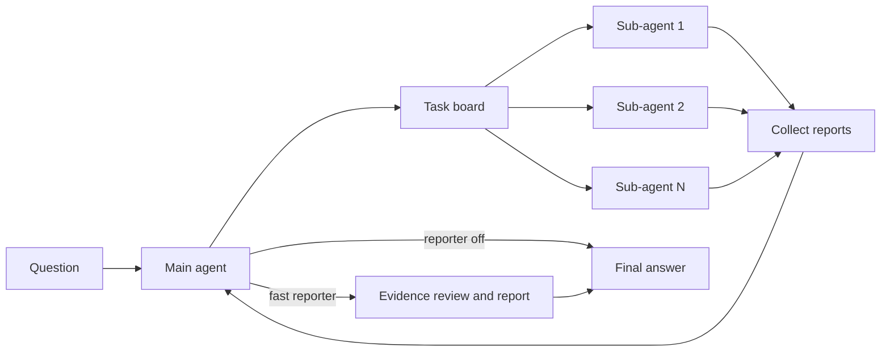

# Agent Team

`agent_team` uses a coordinator to plan research, dispatch parallel sub-agents,
collect their reports, and synthesize a final answer. Reporting is either off or
handled by the `fast` backend.

## Architecture



The main agent communicates with sub-agents through `AgentBus`. `SpawnGuard`
enforces depth, parallelism, and wall-time limits. Sub-agents can search the web,
read files, use the task sandbox, and submit structured reports; they cannot spawn
another team unless the runtime budget explicitly permits it.

## Loop guardrails

Three profile keys arm the reasoning-runaway watchdog; absent or `0` leaves each
one off.

| Key | Shipped value | Effect |
|---|---:|---|
| `reasoning_only_timeout_s` | 120 | Abort a streamed reply that has produced only reasoning for this long |
| `reasoning_only_max_tokens` | 16384 | Abort it at this many estimated reasoning tokens |
| `logical_call_timeout_s` | 900 | Bound one logical LLM call across admission wait, every physical attempt, and retry backoff |

Setting either `reasoning_only_*` key puts the loop on the streaming request
path, which is the only place the watchdog can see reasoning arrive. Protocols
that never stream (`anthropic`, `responses`, `bedrock`) ignore all three; the
post-hoc reduced-cap resample remains the floor there.

Repetition stop-loss is observer-side:

| Observer | Signal | Action |
|---|---|---|
| `DuplicateQueryRollbackObserver` | A `web_search` request already executed in this loop **and returned content** | Pops the turn before the search runs and re-samples, without spending a `max_turns` slot. Never pops a batch carrying a terminal tool |
| `RepetitionGuard` | Consecutive turns with byte-identical tool calls | Hint at 3; stop at `stop_after` where stopping is affordable |
| `TextRepetitionGuard` | Near-verbatim assistant prose across turns | Hint, then stop where stopping is affordable |

`RepetitionGuard` is the only one of the three that can end a loop whose
repetition lives entirely in the tool channel: the rollback's budget expires
into permanent let-through, and `TextRepetitionGuard` needs visible prose,
which a `thinking_format: tag` model does not produce while looping. Its
`stop_after` is therefore enabled wherever a truncated run is recoverable.

The reasoning token cap is load-invariant; `reasoning_only_timeout_s` is wall
clock and its token-equivalent shrinks as endpoint concurrency rises. Trust
the token cap when tuning.

`RepetitionGuard` is deliberately absent from the coordinator: waiting on
running sub-agents means calling `collect_reports` repeatedly with identical
arguments. `NoProgressGuard` owns the coordinator's own spin pathology
(repeated `create_subagent` / `assign_task` with no work coming back).

## Profiles

| Profile | Use | Web implementation | Reporter default | Planning |
|---|---|---|---:|---:|
| `simple` | Deterministic keep-last baseline | Search: original; fetch: aligned | Pipeline-selected | Off |
| `benchmark` | Reproducible evaluation | Search: original; fetch: aligned | Pipeline-selected | Off |
| `tui` | Interactive TUI | Original | Off | Off |

Set `agent.reporter: false` to route the coordinator directly to the terminal
answer. The YAML files contain comments for every group of model, budget,
compaction, planning, and tool settings; start with
[`profiles/simple.yaml`](profiles/simple.yaml),
[`profiles/benchmark.yaml`](profiles/benchmark.yaml), or
[`profiles/tui.yaml`](profiles/tui.yaml) when creating an override.

## Why some names say `swarm`

`swarm` was this subsystem's original name. Nothing called `swarm` exists any
more — this repository has exactly two workflows, `agent_team` and
`stateful_react_agent` — but the word survives on identifiers that other things
bind to, and renaming those would break them rather than tidy them:

| Name | Why it cannot move |
| --- | --- |
| `response.swarm.*` | SSE event namespace consumed by clients |
| `logs/swarm/<task_id>/` | on-disk trajectory layout for standalone runs |
| `swarm_main` | role id peer nodes resolve LLMs by |
| `load_swarm_profile`, `create_swarm_llm`, `build_swarm_session_runtime_spec`, `SwarmSubagentRuntime`, `_swarm_observers` | the profile schema and runtime seam that `plugins/tools/create_subagent.py` imports by name |

So: `swarm` in an identifier means "this workflow, named historically". Comments
and docstrings say `agent_team`. One user-visible string still reads `swarm done`
in the console observer.

`create_subagent` keeps a second naming mode — strict `{topic}_{task_type}[_N]`
sub-agent names, enabled by a workflow declaring `SUBAGENT_TASK_TYPES` in its
prompts module. No workflow here declares it, so that path is an extension seam,
not a live branch; `agent_team` uses free-form role labels.

## Run

```bash
uv sync --extra eval --extra sandbox --extra document-readers
cp .env.example .env

# Coordinator + sub-agents, reporter off.
uv run python -m benchmarks.public.runner.run_subprocess \
  --benchmark browsecomp --pipeline agent_team --profile benchmark \
  --limit 1 --concurrency 1 --out ./results/agent-team-smoke

# Same team with the fast reporter.
uv run python -m benchmarks.public.runner.run_subprocess \
  --benchmark browsecomp --pipeline agent_team_report \
  --profile benchmark --limit 1 --concurrency 1 \
  --out ./results/agent-team-report-smoke
```

Each benchmark worker is isolated in its own subprocess. Total possible model
parallelism is roughly benchmark `--concurrency` multiplied by the sub-agent
parallelism allowed by `SpawnGuard`, so start with concurrency 1.

Set `SWARM_NO_WEB=1` for closed-book tasks. File-aware tasks should also pass
`--fs-mode`; the benchmark runner then supplies the sandbox metadata and mounts.

## Configuration boundaries

- Profiles select prompts, tools, turn budgets, compaction, and reporter behavior.
- `frontier_agent/` owns the generic loop, observers, registries, and AgentBus.
- `plugins/tools/` owns tool implementations and sandbox policy.
- `benchmarks/` is a consumer and is never imported by the framework.

The reporter is fail-open after the coordinator has produced an answer: a fast
reporter failure preserves that answer. Sandbox setup and command authorization are
fail-closed; they never fall back to unisolated host execution.
