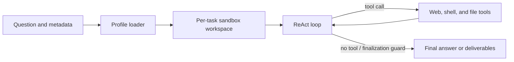

# Stateful ReAct Agent

`stateful-react-agent` runs one ReAct agent in a per-task workspace. It is the
default pipeline for the single-agent benchmark families, including research and
file benchmarks. It supersedes the removed `react_base` workflow while retaining
web research, mounted-input inspection, and persistent deliverables under
`/outputs`.

## Architecture



The workflow uses the shared `run_agent_loop` kernel with stateful observers for
wall-clock enforcement, context compaction, repeated-text detection, stuck-target
handling, and final-answer recovery. A no-tool assistant response is terminal.

## Loop guardrails

Three profile keys arm the reasoning-runaway watchdog; absent or `0` leaves each
one off.

| Key | Shipped value | Effect |
|---|---:|---|
| `reasoning_only_timeout_s` | 120 | Abort a streamed reply that has produced only reasoning for this long |
| `reasoning_only_max_tokens` | 16384 | Abort it at this many estimated reasoning tokens |
| `logical_call_timeout_s` | 900 | Bound one logical LLM call across admission wait, every physical attempt, and retry backoff |

Setting either `reasoning_only_*` key puts the loop on the streaming request
path, which is the only place the watchdog can see reasoning arrive. Protocols
that never stream (`anthropic`, `responses`, `bedrock`) ignore all three; the
post-hoc reduced-cap resample remains the floor there.

Repetition stop-loss is observer-side:

| Observer | Signal | Action |
|---|---|---|
| `DuplicateQueryRollbackObserver` | A `web_search` request already executed in this loop **and returned content** | Pops the turn before the search runs and re-samples, without spending a `max_turns` slot. Never pops a batch carrying a terminal tool |
| `RepetitionGuard` | Consecutive turns with byte-identical tool calls | Hint at 3; stop at `stop_after` where stopping is affordable |
| `TextRepetitionGuard` | Near-verbatim assistant prose across turns | Hint, then stop where stopping is affordable |

`RepetitionGuard` is the only one of the three that can end a loop whose
repetition lives entirely in the tool channel: the rollback's budget expires
into permanent let-through, and `TextRepetitionGuard` needs visible prose,
which a `thinking_format: tag` model does not produce while looping. Its
`stop_after` is therefore enabled wherever a truncated run is recoverable.

The reasoning token cap is load-invariant; `reasoning_only_timeout_s` is wall
clock and its token-equivalent shrinks as endpoint concurrency rises. Trust
the token cap when tuning.

## Profiles

| Profile | Compaction | Tool-result retention | Model configuration |
|---|---|---:|---|
| `simple` | Off (deterministic keep-last) | Last 5 | `OPENAI_*` |
| `benchmark` | Tiered, spill off | Last 5 before summary | `OPENAI_*` |
| `tui` | Tiered | Last 5 | `OPENAI_*`, aligned web tools, task board |

`simple` only blanks old tool-result bodies and never summarizes conversation
history. `benchmark` adds tiered LLM summarization under context pressure but
keeps filesystem spill disabled for comparable runs. `tui` additionally enables
session-scoped spill for product resilience.

The retired names resolve to these: `keep5` → `benchmark` and `Apodex1.1-solve`
→ `tui` are plain renames. `default` → `simple` additionally restores
`keep_last_k: -1`, the retained-everything behaviour the `default` profile had,
so the benchmark commands still pinned to `--profile default` keep measuring
what they measured before the consolidation. Pass `--profile simple` for the
last-5 retention.

## Run

```bash
uv sync --extra eval --extra sandbox --extra document-readers
cp .env.example .env

uv run python -m benchmarks.public.runner.run_subprocess \
  --benchmark browsecomp --pipeline stateful-react-agent \
  --profile simple --limit 1 --concurrency 1 \
  --out ./results/stateful-smoke
```

For file tasks:

```bash
uv run python -m benchmarks.public.runner.run_subprocess \
  --benchmark officeqa --pipeline stateful-react-agent \
  --profile benchmark --fs-mode --limit 1 --concurrency 1 \
  --out ./results/officeqa-smoke
```

The runner mounts benchmark inputs read-only at `/inputs`, gives the agent a
per-question `/workspace`, and preserves `/outputs` for grading when the benchmark
requests deliverables.

## Sandbox modes

`SANDBOX_BACKEND=auto` selects bubblewrap when available and otherwise fails with
setup guidance. `bwrap` requires Linux user namespaces. `container` is only safe
when FrontierAgent already runs inside an isolated task container; it must not be
used as an unisolated host fallback. See [framework sandboxing](../../docs/framework.md#sandboxing).

Set `REACT_NO_WEB=1` to remove web tools and `BASH_ALLOWLIST_MODE` to override the
profile's shell command policy. Authorization and sandbox failures are fail-closed.
