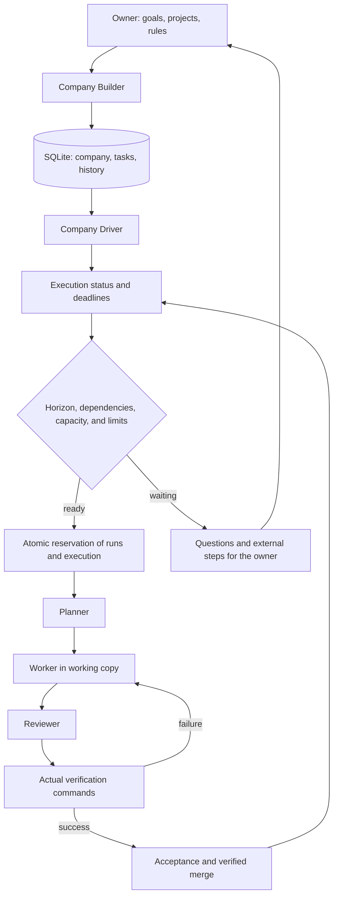

# Company Builder & Driver

Reviewed against alpha.9 on 24 September 2026. The Company is a persistent layer built on top of the existing Execution Controller. It is not a verified replacement for the entire company management system. See the [feature catalog](FEATURES.md) for the dashboard, 3D Office and related product capabilities.

## Usage

1. Open the required working folders in Studio. Select **Company · Builder & Driver**.
2. **Create a company**: name the company, define its goals, select projects, workers, and reviewers. "My Company" is an editable example; no real projects connect automatically.
3. Add specific work: task brief, project, responsible department, criteria, verification commands, priority, and dependencies. Templates include development plans, audits, proposal designs, and financial summaries derived from provided data.
4. For recurring work, set the interval in hours and the maximum number of executions. An interval of 0 means one-time work. The deadline is calculated from the acceptance of the result.
5. In limits, set the horizon, budget of runs, number of executions, steps, and runtime. A new company has automatic tool approval and result acceptance disabled.
6. **Enable Driver** starts supervision. The plan is approved automatically only if there are no open questions. Acceptance can be automatic only after successful independent real-world verifications.
7. In **Decisions and Blocks**, open an execution and answer missing questions. A completed result without verifications requires either adding verifications or explicit manual acceptance.
8. **Download report (.md)** exports the current portfolio, work, and decisions. Project knowledge remains in `PROJECT.md` and related files.

## Loop and Persistence

The controller shares one working slot with Studio. While waiting for answers in one project, it can schedule independent work in another. Two company executions in the same project do not run simultaneously. Products have their own management; the company overview displays them, but does not take over or pause their existing autopilot.

Both the company and reserved executions are written in a single SQLite transaction. Repeated ticks or reloading the controller do not create a second execution for the same item. Driver events are stored in `company_events`; the GUI shows the last 100. Overwriting user forms protects revisions. Automatic progress changes do not invalidate pre-configured settings.

After sleep, missed intervals are not recovered. After three controller errors, the company pauses. Model execution errors are handled by the existing limited retry mechanism; the Driver does not unblock a blocked execution itself. After the horizon expires, explicit renewal is required. The service must be running, and the host must not sleep. Long-term reliability of real models is not proven by the controller’s own tests.

## Limits and Permissions

- The budget is calculated as used runs + reserved remaining runs of open executions.
  Unused reservations are released upon completion; used runs are not refunded. One run may include multiple model requests. This is not a monetary, token, or enterprise-wide provider billing limit. Products and manual tasks have their own limits.
- Direct modification of models and limits of a company execution is rejected to prevent bypassing reservations. Company settings apply to new executions only; existing ones retain their original limits.
- Pausing saves state before stopping subordinate work. Direct API access to an execution cannot bypass a paused company or its horizon. Upon resuming, only executions paused by the company are restored; earlier independent blocks remain.
- Automatic acceptance uses the same verification of current artifacts and test results as manual verified acceptance. A model report alone is insufficient to prove success.
- An external item has no executable execution. The owner records actual execution with proof or rejection. The button does not send, validate, or deploy anything.
- A department is a working context. Workers use Linux bubblewrap isolation, but instructions like "do not send" are not enforced as a network policy. Enable automatic tools only in environments where you grant such permissions; isolated accounts and network policies per department are not available.

## What this version does not integrate

CRM, corporate email, banking, accounting, or remote production. It does not independently select business strategy from live company data, lacks one week of verified autonomy, and does not support 30 concurrent workers. Company Builder creates the company and work rules; the model planner decomposes individual executions into tasks. The company itself does not invent new orders nor increase budgets when the approved queue runs out.

## Verification

`studio/tests/test_company_driver.py` verifies transactional rollback, reservations,
dependencies, intervals, recovery, parent pause, limit-bypass prevention,
external queue, form conflicts, circuit breakers, and HTTP authorization.
The integration scenario runs four actual Frontier processes with a local deterministic model:
plan → file → review → checks → automatic acceptance. This verifies the mechanism and files,
not the intelligence of a live LLM or real company management.
