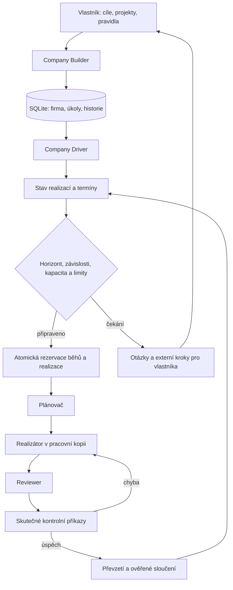

# Tvorba a řízení firmy

Stav: 2026-09-23, lokální verze 0.4.0-alpha.4. Firma je trvalá vrstva nad existujícím
řadičem realizací. Nejde o ověřenou náhradu celého vedení společnosti.

## Použití

1. Otevři potřebné pracovní složky ve Studiu. Zvol **Firma · Tvůrce & Řadič**.
2. **Založit společnost**: pojmenuj firmu, napiš cíle, vyber projekty, realizátora a
   reviewera. Moje firma je upravitelný příklad, žádné skutečné projekty se samy nepřipojí.
3. Přidej konkrétní práci: zadání, projekt, odpovědné oddělení, kritéria, kontrolní
   příkazy, prioritu a případné závislosti. Předlohy zahrnují plán rozvoje, audit,
   návrh nabídky a finanční přehled z dodaných dat.
4. Pro pravidelnou práci nastav interval v hodinách a nejvyšší počet realizací.
   Interval 0 znamená jednorázovou práci. Termín se počítá od převzetí výsledku.
5. V limitech nastav horizont, rozpočet běhů, počet realizací, kroky a čas běhu.
   Nová firma má vypnuté automatické schvalování nástrojů i přebírání výsledků.
6. **Zapnout Řadič** zahájí dohled. Plán se schválí automaticky pouze bez otevřených
   otázek. Převzetí může být automatické jen po úspěchu skutečných nezávislých kontrol.
7. V **Rozhodnutích a blokacích** otevři realizaci a odpověz na chybějící otázky.
   Hotový výsledek bez kontrol vyžaduje doplnění kontrol nebo výslovné ruční převzetí.
8. **Stáhnout report .md** exportuje aktuální portfolio, práci a rozhodnutí. Projektové
   znalosti dál patří do `PROJECT.md` a souvisejících souborů.

## Smyčka a uložení

Řadič sdílí se Studiem jeden pracovní slot. Při čekání na otázky v jednom projektu
může naplánovat nezávislou práci v jiném. Dvě firemní realizace ve stejném projektu
se nespouštějí současně. Produkty mají vlastní správu; přehled firmy je zobrazuje,
ale jejich existující autopilot tím nepřebírá ani nepozastavuje.

Firma i rezervovaná realizace se zapisují v jedné SQLite transakci. Opakovaný tick
ani znovunačtení řadiče nevytváří druhou realizaci stejné položky. Události řadiče
jsou v `company_events`; GUI zobrazuje posledních 100. Přepisy uživatelských formulářů
chrání revize. Automatické změny průběhu nezneplatňují rozepsané nastavení.

Po uspání se nedohání každý zmeškaný interval. Po třech chybách řadiče se firma
pozastaví. Chyby modelové realizace řeší její existující omezené opakování; blokovanou
realizaci Řadič sám neodblokuje. Po vypršení horizontu je nutné jeho výslovné obnovení.
Služba musí běžet a hostitel nesmí spát. Dlouhodobá spolehlivost reálných modelů
není prokázána samotnými testy řadiče.

## Limity a oprávnění

- Rozpočet se počítá jako použité běhy + rezervované zbývající běhy otevřených realizací.
  Při dokončení se nevyužitá rezervace uvolní; použité běhy se nevracejí. Jeden běh
  může obsahovat více modelových požadavků. Toto není peněžní, tokenový ani celofiremní
  limit účtování poskytovatele. Produkty a ruční úlohy mají vlastní limity.
- Přímá změna modelů a limitů firemní realizace je odmítnuta, aby neobešla rezervaci.
  Nastavení firmy mění nové realizace; existující mají původní limity.
- Pozastavení se uloží před zastavením podřízené práce. Přímé API realizace nesmí
  obejít pozastavenou firmu ani její horizont. Při obnovení se obnovují jen realizace,
  které pozastavila firma; dřívější samostatné blokace zůstávají.
- Automatické převzetí volá stejnou kontrolu aktuálních artefaktů a výsledků testů
  jako ruční ověřené převzetí. Modelový report sám úspěch nestačí prokázat.
- Externí položka nemá spustitelnou realizaci. Vlastník zaznamená skutečné provedení
  s dokladem nebo zamítnutí. Tlačítko nic neodesílá, neplatí ani nenasazuje.
- Oddělení je pracovní kontext. Nativní agent má oprávnění uživatele a instrukce
  „neodesílat“ nejsou systémový izolované prostředí. Automatické nástroje zapínej jen v prostředí,
  kterému chceš tato oprávnění dát; chybí izolované účty a síťové politiky po odděleních.

## Co tato verze nepřipojuje

CRM, firemní poštu, banku, účetnictví ani vzdálenou produkci. Nevybírá samostatně
obchodní strategii z živých firemních dat, nemá týden ověřené autonomie a nemá 30
současných pracovníků. Company Tvůrce vytváří firmu a pracovní pravidla; modelový
plánovač rozkládá jednotlivé realizace na úkoly. Firma sama nevymýšlí nové zakázky
ani nezvyšuje rozpočty, když dojde schválená fronta.

## Ověření

`studio/tests/test_company_driver.py` ověřuje transakční rollback, rezervace,
závislosti, intervaly, obnovu, rodičovskou pause, zabránění obejití limitů,
externí frontu, konflikty formulářů, jistič chyb a HTTP autorizaci.
Integrační scénář spouští čtyři skutečné Frontier procesy s lokálním deterministickým
modelem: plán → soubor → review → kontroly → automatické převzetí. To ověřuje
mechanismus a soubory, ne inteligenci živého LLM ani vedení reálné firmy.
