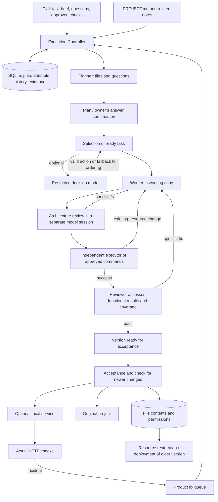

# Switch Studio Loop: From Task Brief to Verified Version

Status: 2026-09-23. The controller, resources, and GUI run locally. Models may run on a different machine. Closing a tab does not stop the current work; terminating Studio or putting the host to sleep does.
This document describes the implementation; it is not confirmation of a week-long operational run.

Tool timeouts are capped at no more than one-third of the task attempt’s time limit (or the profile’s stricter limit). Some specialized tools have their own fixed minimum. The overall attempt limit is still enforced by the controller; repeated calls do not extend it. A one-time native shell is not a service manager: the test process must be terminated by the control script in the same call. A permanently running service is started by the deployment controller. Longer compilations require a corresponding attempt limit—not circumvention of the timeout via a background process.

Model and tool timeouts are kept inside the attempt budget, so the controller's external stop is a last resort. When only a few turns or a small share of the time remain, the worker is told to save its report now. Each run records a status (`completed`, `incomplete`, `failed` or `cancelled`), a reason and a failure kind. A mission run that ends without a saved report is `incomplete`, never `completed`. An unavailable model endpoint is treated as transient and retried later without spending an attempt; time, turn, progress-guard and missing-report stops are recoverable within bounded limits.



## What Completion Means

The model saves a JSON report and product files. The controller verifies structure, existence, checksums, and coverage of criteria. The model’s assertion “test passed” alone does not count as a successful independent check.

New missions use an architecture-and-functionality workflow. The coder implements and supplies a concise handoff describing responsibilities, interfaces, behavior, scenarios and limitations. Task review focuses on architectural fit and evidence, not style or a line-by-line source audit. For research and document tasks, the same stage assesses structure, source support and usability.

After all task reviews, the controller executes the approved functional checks. Failures return to the coder before final model review. The final reviewer receives the actual exit codes and bounded log excerpts and assesses scenario coverage. A valid result is reused for acceptance only while file contents, permissions and check definitions still match. Existing missions retain their saved verification order; this change does not reopen expired work. Missing checks still require explicit owner action and cannot become automatic verified acceptance.

The owner specifies check commands in the GUI. Each line is a list of arguments separated by shell quoting; operators like `&&`, redirections, or `$()` are not automatically evaluated. A command may explicitly invoke an interpreter, so approve its content. The GUI uses a 5-minute timeout; the API accepts `argv`, `label`, and `timeout` between 1–3600 seconds.

The executor stores the command, start/end timestamps, exit code, and a limited log. Before checks, after checks, and at acceptance, resources—including file permissions—must match. Changing resources during tests requires re-verification. Build outputs within the tracked scope also constitute a change; for such projects, configure the check procedure to verify a stable result.

Without approved checks, the process waits. Manual acceptance has special confirmation and is marked `manual`; it provides no evidence of test execution and cannot be automatically deployed by this backend.

## Isolation and Versions

A new execution gets a copy of the resources under `.switch-agent/studio/workspaces/<id>`. At acceptance, changes are compared against the baseline version and the original project. Unrelated owner edits remain; conflicts are rejected. Working-copy protection is supplemented by mandatory Linux bubblewrap isolation. Network access and the host kernel remain shared; see ../../SECURITY.md.

Content objects reside under `.switch-agent/studio/objects/`; version metadata and restore journal are stored in SQLite. Before restoration, a backup of the current tracked content is created. A write failure or interruption reverts to the previous state; a newer conflict during restoration requires owner intervention. Individual files are written atomically; the entire file set is not a single filesystem transaction.

In **Backup before last restore**, you can preview and revert to the content before that restore—including your own file edits. A newer change after previewing rejects the action; re-preview and inspect the diff. Reversion changes resources—not the running service.

Limits: max 50 MB/file, 500 MB total, 20,000 files. Symlinks are rejected. `.env*`, `.git`, `.venv`, `node_modules`, caches, Studio operational metadata, and reports under `company/projects/` are excluded. File/folder name swaps are rejected before writing; move manually and re-preview. Product database, access credentials, and installed dependencies require separate backup and management.

## Decision-Making and History

Default task selection uses ordering and dependencies defined in Python. An optional compatible chat profile receives a narrow frame with only ready actions. Policy is in `studio/templates/decision-policy.md`. Invalid responses, timeouts, or low model confidence revert to ordering. Confidence is the model’s assertion—not a calibrated probability. This selection mechanism cannot bypass confirmation, pause, or tests.

Inspiration: [JevLoop](https://github.com/zjunlp/JevLoop). The phenomenon itself is not connected; this is an optional task selection—not a restructuring of every tool call. A synthetic pilot is in development at `analysis/audit/DECISION_PILOT.md`.

History **Why the process changed** shows the reason, phase, report and its hash, file changes, run duration, models used, and available tokens. Token estimates differ from provider data. Monetary cost is not computed without verified pricing.

Change history is created in the same database transaction as the execution state.

Switch web tools return a limited page text directly to the chosen worker model. Standalone model-based page extraction is disabled to prevent use of the default cloud model without owner selection. Any Serper/Jina services for page search or download are separate configurations.

## Local Deployment and Fixes

In **Products → Local deployment, availability, and fixes**, set a command, e.g.:

```text
python3 -m http.server {port} --bind {host}
```

Studio substitutes loopback and an available port. The service receives a dedicated copy of the verified version. Persistent data should go to `{data_dir}` or a path from `SWITCH_DATA_DIR`; the version identifier is in `SWITCH_RELEASE_ID`. The command must be executable with the provided environment; Studio does not install dependencies or migrate databases.

**Stop local service** also cancels pending automatic deployments and disables automatic acceptance and deployment. Re-enable this option for new automatic versions.

A new service must own its own process tree on the given port and pass HTTP checks twice (200 OK, optionally with expected text) before the previous process is stopped. Failure of the candidate preserves the currently running service. Checks run roughly every two seconds; startup has 30 seconds; a running service tolerates two errors. A third error or process termination creates an incident. Multiple failing services may extend the interval; this is not external independent monitoring.

Upon a recorded subprocess termination, its actual exit code and signal name (e.g., SIGTERM) are preserved separately from the supervisor process’s result. Older or interrupted supervision may only have a generic result. A signal alone does not indicate who sent it or why; diagnostics must not automatically infer the outage cause from the last HTTP request.

Options are independent and disabled by default:

- Forward incident to the active product’s fix queue—once per incident.
- On enabled automatic resumption, accept and deploy a successfully verified version.
- Restore service after Studio restart—up to three attempts per restore sequence.

One minute of successful stable operation ends the restore sequence; a later restart starts a new limit. Failing startups alone do not reset this limit.

Each deployment has its own local URL. There is no stable reverse proxy, public hosting, HTTPS domain, or remote production adapter. **Deploy local version N** allows reverting the service to older verified content; **Restore version N** modifies project resources. Neither action restores operational databases. Older code must be data-compatible.

## Outages and Operational Boundaries

Session checkpoints are written atomically with `fsync`; failure halts work and appears in logs. Pausing the parent product prevents restoration of its execution. Process identity is stored before activation and verified by PID and creation time.

Models and limits for subsequent runs can be changed after stopping execution. Changing them alone does not resume work or extend the overall deadline. Repetition after an outage does not guarantee exactly one execution of any external action. Payments and communication sending are outside the automatic mode of this controller.

Long-term operation requires a permanently available host and independent measurement. A test with simulated time or a local model fixture does not substitute for a real day or week.

## Bounded judgments (alpha.6)

See [the review contract and Decision lab](DECISION_LAB.md). Review reads immutable, size-limited evidence and emits typed per-criterion outcomes. Optional selection supports Off, Shadow and Select; all model proposals remain inside deterministic eligibility, freshness, timeout and acceptance checks. The UI exposes the evidence packet and the actual decision/fallback reason.
