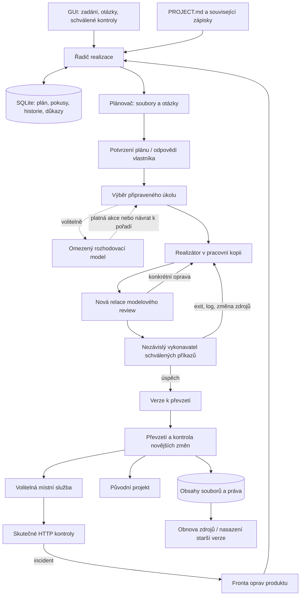

# Smyčka Switch Studia: od zadání k ověřené verzi

Stav 2026-09-23. Řadič, zdroje i GUI běží lokálně. Modely mohou běžet na jiném
počítači. Zavření záložky práci nezastaví, ukončení Studia nebo uspání hostitele ano.
Tento dokument popisuje implementaci; není potvrzením týdenního provozu.

Základní limit nástrojů má nejvýše třetinu časového limitu pracovního pokusu
(nebo kratší limit profilu). Některé specializované nástroje mají vlastní
pevné minimum. Celkový limit pokusu dál hlídá řadič; opakovaná
volání jej neprodlužují. Jednorázový nativní shell není správce služeb:
testovací proces musí kontrolní skript ukončit ve stejném volání. Trvale
běžící službu spouští nasazovací řadič. Delší kompilace vyžaduje odpovídající
limit pokusu, nikoli obcházení timeoutu procesem na pozadí.



## Co znamená dokončení

Model ukládá JSON report a produktové soubory. Řadič ověřuje strukturu, existenci,
kontrolní součty a pokrytí kritérií. Tvrzení modelu „test prošel“ se samo nepovažuje
za úspěšnou nezávislou kontrolu.

Vlastník v GUI zadá příkazy kontrol. Každý řádek je seznam argumentů rozdělený
podle shellového quoting; operátory `&&`, přesměrování nebo `$()` se automaticky
nevyhodnocují. Příkaz může výslovně spouštět interpreter, proto schvaluj jeho obsah.
GUI používá timeout 5 minut; API přijímá `argv`, `label` a `timeout` 1–3600 sekund.

Vykonavatel uloží příkaz, začátek a konec, exit code a omezený log. Před kontrolami,
po nich a při převzetí musí odpovídat zdroje včetně práv souborů. Změna zdrojů během
testů vyžaduje nové ověření. Výstupy buildů uvnitř sledovaného rozsahu jsou také
změnou; pro takový projekt nastav kontrolní postup tak, aby ověřoval stabilní výsledek.

Bez schválených kontrol se čeká. Ruční převzetí má zvláštní potvrzení a označení
`manual`; neposkytuje důkaz spuštění testů a nelze je tímto backendem automaticky nasadit.

## Izolace a verze

Nová realizace má kopii zdrojů pod `.switch-agent/studio/workspaces/<id>`.
Při převzetí se změny porovnají s výchozí verzí a původním projektem. Nesouvisející
úpravy vlastníka zůstanou; konflikt se odmítne. To je ochrana běžného pracovního
postupu, nikoli OS izolované prostředí. Nativní příkazy mají stále oprávnění uživatele.

Obsahové objekty jsou pod `.switch-agent/studio/objects/`; metadata verzí a žurnál
obnovy jsou v SQLite. Před obnovou vznikne záloha současného sledovaného obsahu.
Selhání zápisu nebo přerušení vede k návratu předchozího stavu; novější konflikt
při obnově vyžaduje zásah vlastníka. Jednotlivé soubory se zapisují atomicky,
celá sada souborů není jednou filesystemovou transakcí.

V **Záloha před poslední obnovou** lze zobrazit náhled a vrátit obsah před touto
obnovou, včetně vlastních úprav souborů. Novější změna po náhledu akci odmítne;
obnov náhled a zkontroluj rozdíl. Návrat mění zdroje, nikoli běžící službu.

Rozsah: nejvýše 50 MB/soubor, 500 MB a 20 000 souborů. Symlinky se odmítají.
Vynechávají se `.env*`, `.git`, `.venv`, `node_modules`, cache, provozní metadata
Studia a reporty pod `company/projects/`. Záměna souboru a složky se odmítá před
zápisem; přesuň ji ručně a obnov náhled. Databáze produktu, přístupy a instalované
závislosti vyžadují vlastní zálohu a správu.

## Rozhodování a historie

Výchozí výběr úkolu používá pořadí a závislosti v Pythonu. Volitelný kompatibilní
chat profil dostává malý rámec pouze s připravenými akcemi. Politika je v
`studio/templates/decision-policy.md`. Neplatná odpověď, timeout nebo nízká
modelová důvěra vrátí výběr k pořadí. Důvěra je tvrzení modelu, nikoli kalibrovaná
pravděpodobnost. Model nemůže tímto výběrem přeskočit potvrzení, pause nebo testy.

Inspirace: [JevLoop](https://github.com/zjunlp/JevLoop). Jev samotný není připojen;
jde o volitelný výběr úkolů, ne přestavbu každého volání nástroje. Syntetický pilot
je ve vývojové kopii v `analysis/audit/DECISION_PILOT.md`.

Historie **Proč se postup změnil** ukazuje důvod, fázi, report a jeho otisk,
změny souborů, délku běhu, modely a dostupné tokeny. Odhad tokenů se odlišuje
od údajů poskytovatele. Peněžní cena bez ověřeného ceníku není dopočítaná.
Historie změn vzniká ve stejné databázové transakci jako stav realizace.

Webové nástroje Switch vracejí omezený text stránky přímo zvolenému pracovnímu
modelu. Samostatná modelová extrakce stránky je vypnutá, aby se bez výběru
vlastníka nepoužil výchozí cloudový model. Případné Serper/Jina služby pro
vyhledání nebo stažení stránky jsou oddělenou konfigurací.

## Místní nasazení a opravy

V **Produkty → Místní nasazení, dostupnost a opravy** nastav příkaz, například:

```text
python3 -m http.server {port} --bind {host}
```

Studio dosadí loopback a volný port. Služba dostane zvláštní kopii ověřené verze.
Trvalá data ukládej do `{data_dir}` nebo cesty z `SWITCH_DATA_DIR`; identifikátor
verze je v `SWITCH_RELEASE_ID`. Příkaz musí dostupné prostředí umět spustit;
Studio samo neinstaluje závislosti ani nemigruje databáze.

**Zastavit místní službu** také zruší čekající automatické nasazení a vypne
automatické převzetí a nasazení. Pro nové automatické verze tuto volbu znovu zapni.

Nová služba musí na daném portu patřit vlastnímu stromu procesů a dvakrát po sobě
projít HTTP kontrolou 200, případně očekávaným textem. Teprve pak se předchozí
proces zastaví. Selhání kandidáta zachová předchozí běžící službu. Kontroly běží
přibližně po dvou sekundách; start má 30 sekund, běžící služba toleruje dvě chyby.
Třetí chyba nebo konec procesu vytvoří incident. Selhání několika služeb může
interval prodloužit; nejde o externí nezávislý monitoring.

Při zaznamenaném konci podprocesu se zachová jeho skutečný exit kód a název
signálu (například SIGTERM), odděleně od výsledku dohlížecího procesu. Starší
nebo přerušený dohled může mít pouze obecný výsledek. Ani signál sám neurčuje,
kdo jej odeslal nebo proč; diagnostika nesmí z posledního HTTP požadavku
automaticky odvodit příčinu výpadku.

Volby jsou samostatné a výchozí vypnuté:

- Předat incident do fronty oprav aktivního produktu, právě jednou pro daný incident.
- Při zapnutém automatickém navazování převzít a nasadit úspěšně ověřenou verzi.
- Obnovit službu po restartu Studia, nejvýše tři pokusy v dané obnovovací řadě.

Minuta úspěšného stabilního provozu obnovovací řadu ukončí; další pozdější restart
má nový limit. Selhávající starty samotné tento limit nenulují.

Každé nasazení má vlastní místní URL. Není zde stabilní reverse proxy, veřejný
hosting, HTTPS doména ani vzdálený produkční adaptér. **Nasadit místně verzi N**
umožňuje návrat služby na starší ověřený obsah; **Obnovit verzi N** mění zdroje
projektu. Ani jedna akce nevrací provozní databázi. Starší kód musí být s daty kompatibilní.

## Výpadky a provozní hranice

Checkpoint relace se zapisuje atomicky s `fsync`; jeho chyba zastaví práci a je
vidět v logu. Pause nadřazeného produktu brání obnovení jeho realizace. Identita
procesů se ukládá před jejich aktivací a ověřuje podle PID i času vzniku.

Modely a limity dalších běhů lze změnit po zastavení realizace. Změna sama
neobnoví práci ani neprodlouží celkový termín. Opakování po výpadku není zárukou
přesně jednoho provedení libovolné externí akce. Platby a odesílání komunikace
nepatří do automatického režimu tohoto řadiče.

Dlouhý provoz vyžaduje trvale dostupného hostitele a samostatné měření. Test
se simulovaným časem nebo lokální fixture modelu nenahrazuje skutečný den či týden.
