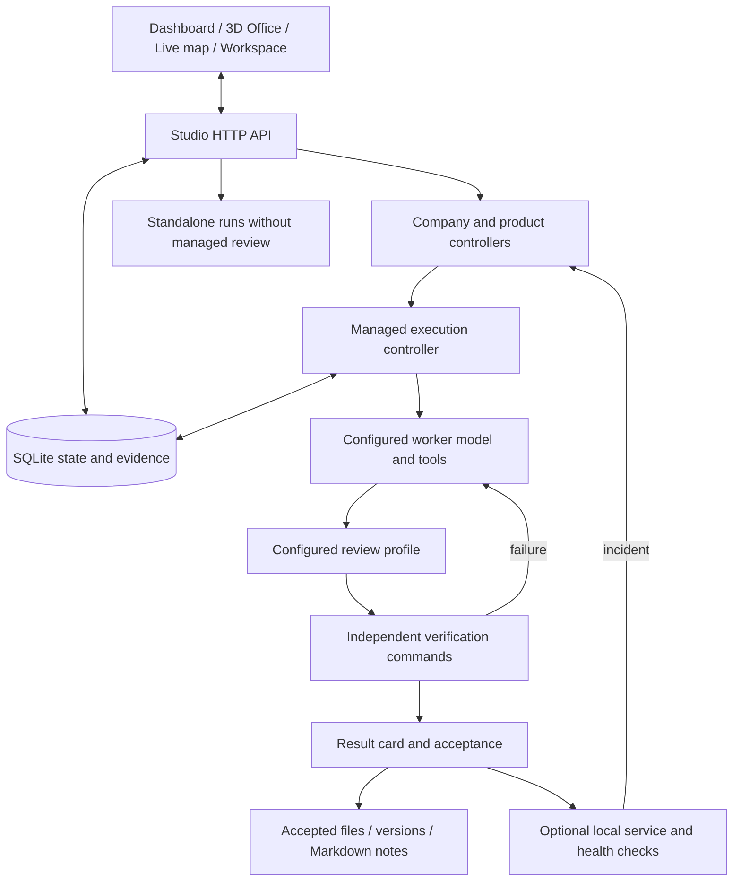

# Feature catalog — Miner / Switch Studio

Source-reviewed on 24 September 2026 against alpha.9 and updated for the alpha.10 execution model. This catalog describes
implemented application behavior, not a claim that every optional provider or
external business system has been configured. The application is experimental.

**Implemented** means the feature exists in the shipped application. **Optional**
means additional configuration, credentials or host tools are required.
**Experimental** means a bounded capability whose broader quality or reliability
has not been established. None of these labels guarantees the quality of a model's output.

## Dashboard and visual monitoring

| Feature | Behavior and example | Status / boundary |
| --- | --- | --- |
| Dashboard as the home screen | Shows working processes, attention items, task board and companies across registered projects. Example: find work running in another workspace without switching projects. | Implemented; visible dashboard refreshes every five seconds and labels stale/offline state. |
| Quick assignment | Choose project and company/department or standalone model, add instructions and observable “Done when” criteria. | Implemented; company tasks queue under their Driver, standalone tasks start without the managed review cycle. |
| Task board and filters | Inspect open, all or completed work; open the corresponding execution or project. | Implemented; completed standalone history is bounded and is not proof of accepted product delivery. |
| Attention and approvals | Open pending tool approvals, plans, acceptance requests and blockers from the overview; use Yes / No / custom input where applicable. | Implemented; conflicting briefs require revision, not a meaningless Yes response. |
| 3D Office company floor | Browse original isometric department islands and occupied desks showing recorded tasks and runs. Example: select a reviewing desk to identify the reviewer and blocker. | Implemented with browser CSS 3D; no ComfyUI job, mesh renderer, dedicated inference GPU or external scene service is required. |
| Office camera and filters | Rotate, drag, zoom, reset camera and filter by company or all workspaces. Switch to List view on small screens or for accessible navigation. | Implemented; the scene shows up to four priority tasks per department while the roster retains all items in scope. |
| Office status and animation | Distinguishes working, reviewing, checking, queued, attention, blocked, paused, accepted, finished and stopped states. | Motion requires recent recorded activity. A quiet process is “Awaiting activity”; offline mode stops movement and marks the snapshot stale. Empty desks are illustrative. |
| Office drill-down | Open a selected task's live map, run/approvals or company from the detail panel. | The view reads existing controller APIs; it neither schedules extra workers nor grants department permissions. |
| Live dependency map | Show actual task dependencies, current phase, blockers, step details and recent events; “Find current step” locates the active work. | Implemented; a status visualization, not a neural-network graph or a simulation of imaginary work. |
| Activity and run history | Read streamed output, available reasoning, tool calls, approvals, logs and output files; restore the visible history after reload. | Implemented; reasoning/usage availability depends on the selected backend. Finished process status is separate from verified acceptance. |
| Contextual help | Question-mark controls explain purpose, use and an example; keyboard activation, Escape and focus return are supported. | English built-in UI/help. Prompts direct agents to write reports, questions, summaries, notes and documentation in English regardless of the input language. Reduced-motion preferences are respected by Office. |

Guides: [Dashboard](DASHBOARD.md), [3D Office](OFFICE.md).
Implementation: [dashboard.js](../static/dashboard.js), [office.js](../static/office.js),
[office.css](../static/office.css), [missions.js](../static/missions.js).
Regression coverage: [dashboard](../tests/dashboard-ui.cjs), [office](../tests/office-ui.cjs),
[map](../tests/flow-ui.cjs), [help](../tests/help-ui.cjs).

## Workspace and project knowledge

| Feature | Behavior and example | Status / boundary |
| --- | --- | --- |
| Project folders and file tree | Register an existing folder, inspect files and choose the workspace for new work. | Files live on the Studio host; opening Studio remotely does not make paths refer to the browser's computer. |
| Text editor | Read/write UTF-8 files up to 2 MB, create files, use line numbers, Tab and Cmd/Ctrl+S, or reload from disk. | Implemented; revision checks reject concurrent overwrites. Save editor changes before asking an agent to use them. |
| File/output inspection | Refresh the tree after an agent writes files; inspect saved contents, run outputs and artifact downloads. | Project files and run artifacts have distinct locations. A model's text response is not a saved file. |
| Static web preview | Start a separate loopback preview for a saved HTML entry or generate a starter `index.html` in a new folder. | Implemented for static HTML/CSS/JS and pre-built static output; no backend, database or framework build is created automatically. |
| Preview tools | Auto-reload changed/missing assets, manually reload, open a separate tab and select a 390 px viewport. | One preview at a time. Mobile width is not device emulation. External services/CDNs are blocked by the preview policy. |
| Markdown context | Include saved `PROJECT.md` in new work; link decisions, sources and deeper notes from that guide. | Implemented with context limits. SQLite remains the authority for live task status. |
| Acceptance notes | Append timestamped snapshot records, a bounded attributed review summary and output links/hashes to `notes/NOTES.md`, `DECISIONS.md` and `SOURCES.md`; index them from `PROJECT.md`. | Conflict-checked, recoverable and idempotent; explicit write restrictions are respected. Historical acceptance does not prove current deployment health. |

Guides: [Workspace](../README.md#features), [Preview](WEB_PREVIEW.md),
[Markdown notes](MARKDOWN_NOTES.md), [accepted-change records](DELIVERY_WORKFLOW.md#4-keep-markdown-reference-notes-current).
Implementation: [server.py](../server.py), [preview.py](../preview.py), [delivery.py](../delivery.py).

## Models, agents and tools

| Feature | Behavior and example | Status / boundary |
| --- | --- | --- |
| Model profiles | Add/select OpenAI-compatible endpoints, including Ollama; probe the endpoint's model list and configure context/output limits. | Optional endpoint configuration. No model weights, hardware performance guarantee or cloud account is bundled. |
| Worker/reviewer selection | Select separate profiles for implementation and review. Example: local coder on one host and a thinking model on another. | Managed projects have separate review sessions; configure a different profile/model when independent-model review is required. Standalone work has no such cycle. |
| Native single agent | Run a ReAct task against the selected project with tools and a main-agent step limit. | Linux bubblewrap required; no unsafe fallback. Native macOS execution is disabled. |
| Native Agent Team | Use backend delegation and inspect worker-creation events. | Implemented backend mode; the GUI does not implement arbitrary recursive department trees or a guaranteed 1 → 5 → 25 worker hierarchy. |
| Files, shell and research | Use configured file read/write/search, shell and web tools in the applicable worker phase. | Tools are phase/configuration dependent; search/fetch providers may need separate setup. Review phases intentionally have a narrower tool set. |
| Document readers | Extract supported PDF and Office content for agent work. | Reader dependencies are included by setup; format/scan handling has limits. Office ZIP expansion and chart XML have explicit security bounds. |
| Optional ChatGPT/Codex account adapter | Use Studio's account controls with an installed local Codex CLI/App Server; forward supported approval requests to the GUI. | Adapter retained, but execution is disabled pending an isolated credential broker. |
| Optional Claude Console adapter | Use the implemented Anthropic CLI account flow and native agent runtime. | Adapter retained, but execution is disabled pending an isolated credential broker. |
| Stop and cleanup | Stop the monitored process tree and record cancellation after cleanup; forced termination follows when necessary. | Implemented process management, not containment of intentionally hostile code. |
| Tool approval controls | Approve individual actions or explicitly enable supported task/company auto-approval. | Auto-approval is off by default and separate from result acceptance; changing process mode does not grant permissions. |

Guides: [models, accounts and runtime scope](../README.md), [review contract](DECISION_LAB.md#review-contract).
Implementation: [runner.py](../runner.py), [oauth.py](../oauth.py),
[Codex adapter](../codex_runner.py), [process management](../process_tree.py).

## Managed delivery, evidence and recovery

| Feature | Behavior and example | Status / boundary |
| --- | --- | --- |
| AI Projects | Persist a brief, reference materials, criteria, plan, dependencies, questions and execution state. | Implemented experimental long-running mode; saving a brief alone does not start inference. |
| Brief readiness | Validate required configuration, catch recognized scope conflicts and require a readiness assessment for complex planning. | Heuristic/model-assisted, not proof of every possible contradiction. Revisions retain the previous wording and reason. |
| Light / Standard / Sensitive | Adjust implementation and context budgets to scope; sensitive paths or scope escalate handling. | Review remains in place. Light cannot override detected sensitive scope or silently enable auto-approval. |
| Architecture and functional review | Review responsibilities/interfaces and supplied evidence; return findings to the worker, then review functional coverage with actual check results. | Reviewer claims alone are not independent execution evidence. Bounded packets, tools, turns and deadlines keep review finite. |
| Independent verification commands | Run owner-approved command arguments, retain exit codes/logs and require a positive executed count for recognized test commands. | Zero-test, skipped-only and unrecognized test summaries cannot pass as executed tests. Check choice determines what is actually verified. |
| Result card | Combine outputs, hashes, checks, review, acceptance, note-sync status and limitations; detect source, permission or bound Git revision changes. | Stale evidence requires new verification. A workspace without Git is bound to file hashes, not a fictitious parent commit. |
| Acceptance choices | Accept a verified delivery, or explicitly record manual acceptance when appropriate. | Manual acceptance is labeled; it does not become successful test evidence or qualify for automatic verified deployment. |
| Compact handoff | Save goal excerpt, completed/pending steps, blockers, last verified command and file revisions before attempts. | Up to 4.5 KB for Light and 8 KB otherwise. Changed files are marked for rereading; omitted items are visible. |
| Restart and pause recovery | Persist controller/attempt state, reconcile interrupted work and respect paused parent companies/products. | Tested controller mechanisms; not an exactly-once guarantee for arbitrary external side effects or verified seven-day autonomy. |
| Source versions and merge | Stage managed work in a copy, save content/permission snapshots and reject conflicting merges. | The working copy protects project edits; OS-level isolation comes from the Linux bubblewrap sandbox that runs the workers. |
| Restore and rollback preview | Preview recorded changes, back up current tracked content, restore a version or return to the pre-restore snapshot. | Credentials, dependencies and operational databases are outside the file restore; conflicts and unsupported file/folder swaps need intervention. |
| Trace and budget history | Inspect phase changes, decisions, file changes, run duration, model identity and available usage; set attempt/time/horizon limits. | These limits are not a provider-wide monetary cap. Token estimates and provider-reported usage are distinct. |

Guides: [Delivery workflow](DELIVERY_WORKFLOW.md), [AI Projects](LONG_RUNNING_PROJECTS.md),
[Control loop](CONTROL_LOOP.md).
Implementation: [missions.py](../missions.py), [workflow.py](../workflow.py),
[verification.py](../verification.py), [versions.py](../versions.py), [review_packet.py](../review_packet.py).
Coverage: [delivery tests](../tests/test_delivery_workflow.py), [mission tests](../tests/test_missions.py),
[verification tests](../tests/test_verification.py), [version tests](../tests/test_versions.py).

## Company, products and operation

| Feature | Behavior and example | Status / boundary |
| --- | --- | --- |
| Company Builder | Define company goals, projects, departments, worker/reviewer profiles and operating limits. | Implemented; a department supplies work context, not a separate security identity. |
| Company Driver | Schedule eligible assignments by priority/dependencies and coordinate independent work around blockers. | Shares one active worker slot with Studio. The company queue does not launch 30 parallel workers. |
| Recurring work and bounded loops | Repeat accepted assignments at configured intervals, enforce horizon and execution/run reservations, pause on repeated controller errors. | Host and service must remain available. Missed intervals do not cause a catch-up flood. Blocked company work gets a bounded number of automatic recovery rounds, each recorded as a Driver event, before the owner is asked; nothing is unblocked silently. |
| External owner items and reports | Record owner-performed external actions with evidence or rejection; download a portfolio/work/decision report as Markdown. | Recording an action does not send a message, make a payment or execute a deployment. |
| 30-role AI Build Company template | Save editable role instructions across leadership/operations, growth, delivery and internal IT/data/AI; attach a project brief. | Organizational template only. Saving it neither starts agents nor connects a real company. |
| Product cards and change queue | Keep product purpose, users and permanent criteria; queue fixes/features and track accepted versions. | Product types provide model context, not preinstalled stacks or guaranteed products. |
| Product autopilot and maintenance | Optionally sequence queued executions and create bounded maintenance requests at configured intervals. | Disabled by default, with execution limits. Deployment, tool approval and acceptance are separate settings. |
| Local service deployment | Start an approved command on loopback from verified content; promote it after two successful HTTP checks. | Optional local service only; no public hosting, HTTPS domain, database migration or automatic dependency installation. |
| Health incidents and repair queue | Record failed health checks/exits, optionally queue a repair and optionally restore a service after restart. | Internal monitoring with bounded retries, not an independent availability service. |
| Redeploy a prior version | Select older verified service content while preserving the previous process if a replacement fails its startup checks. | Does not roll back operational databases; code must remain compatible with stored data. |
| SSH inventory | Read fixed system/service/project/integration inventory from explicitly allowlisted hosts and missions. | Optional key-based, read-only connector with host-key checks; no generic remote administration or automatic discovery of credentials. |

Guides: [Company Driver](COMPANY_DRIVER.md), [template](../templates/README.md),
[Products](PRODUCT_LIFECYCLE.md), [local deployment](CONTROL_LOOP.md#local-deployment-and-fixes),
[SSH configuration](../../INSTALL.md#read-only-ssh-inventory-for-a-mission).
Implementation: [companies.py](../companies.py), [products.py](../products.py),
[deployments.py](../deployments.py), [ssh_inventory.py](../ssh_inventory.py).

## Decision experiments

| Feature | Behavior and example | Status / boundary |
| --- | --- | --- |
| Typed task selector | Off preserves deterministic ordering; Shadow records suggestions; Select can choose among eligible tasks with deterministic fallback. | Experimental; stale or malformed proposals cannot bypass dependencies, pause, approvals or acceptance. |
| Decision lab | Evaluate supplied product-idea, document or CRM-request text; save a Markdown report with input identity, rubric, model and reported usage. | Experimental model assessments; no private CRM is queried or changed and no business outcome is guaranteed. |
| Optional TypeSafe provider | Route supported bounded judgments through an explicitly selected external provider. | Optional credentials and data transfer; disabled until selected. Transport fixtures do not prove live provider quality. |
| Local browser pilot | Exercise allowed actions in a built-in search/filter fixture with state fingerprints, expiring one-use leases and result checks. | Experimental fixture only; not general browser automation across websites, accounts or tabs. |
| Evaluation scripts | Run deterministic contract cases or export/run a synthetic judge dataset with an explicitly chosen model. | Mechanism/evaluation tooling, not a representative production benchmark or parity claim. |

Guide: [Decision lab and bounded review](DECISION_LAB.md).
Implementation: [decisions.py](../decisions.py), [decision_lab.py](../decision_lab.py),
[browser_pilot.py](../browser_pilot.py), [evaluation scripts](../../scripts/).

## Distribution, verification and security

| Feature | Current scope |
| --- | --- |
| Self-hosted web application | Python backend and browser UI without a frontend build or CDN. Local models do not require a cloud account. |
| Platform packages | macOS, Linux and Windows via WSL2 source archives with launchers, manifests and SHA-256 checksums. Agent execution needs the Linux (or WSL2) backend with bubblewrap; macOS runs the UI only. No signed native installers or bundled model weights. |
| Persistence | SQLite stores projects, companies, products, decisions and verification state; files hold outputs, logs, content objects and Markdown knowledge. |
| Local release checks | Backend/frontend tests, publication signature checks and archive manifest verification; a separate locked dependency audit. Sandbox-dependent tests run on Linux with bubblewrap and are skipped elsewhere. Release verification does not depend on hosted CI. |
| Verified alpha.9 baseline | 241 backend tests passed, one optional test skipped, and 92 frontend checks passed on macOS and Linux. [Release receipts](https://github.com/RulezZzOr/miner/releases/tag/v0.4.0-alpha.9) identify tested source and archives. Since alpha.10, execution tests need Linux with bubblewrap. Windows/WSL2 end-to-end use is not established by these runs. |
| Request and file safeguards | Host/Origin/request-token checks, protected paths, no-follow file access, conflict checks, bounded readers and explicit approval handling. |
| Security boundary | Single-owner login, TLS on LAN, private runtime files, Linux bubblewrap for workers/checks. No RBAC, network egress isolation or separate kernel. |
| Audit and provenance | [Dated audit](../../docs/AUDIT-2026-09-24.md), [security policy](../../SECURITY.md), [third-party notices](../../THIRD_PARTY.md) and retained upstream attribution. |

Not currently provided: ready-made CRM/Vapi/Buffer/banking integrations, autonomous
operation of an entire business, verified continuous week-long delivery, arbitrary
recursive department execution, universal browser control, an LSP/debugger/full
interactive terminal in the editor, or public production hosting with identity
isolation. External systems need explicit integration and separate live validation.

## How the pieces connect

The diagrams and office read the same recorded work; they are additional views,
not separate agent schedulers. Start with Dashboard for new assignments, Workspace
for files, 3D Office for orientation and Result card for delivery evidence.
