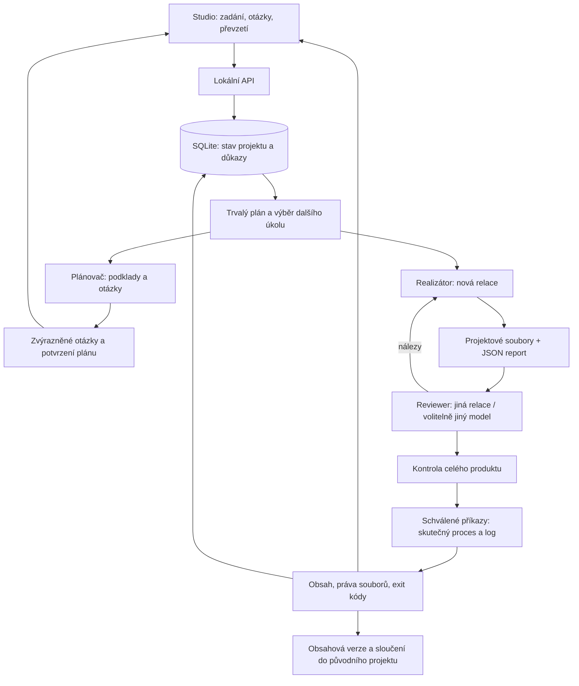

# Dlouhodobé projekty AI Build Company

Stav: implementovaný experimentální režim ve Studiu. Týdenní nepřetržitý provoz ani spolehlivá dodávka komplexního produktu na lokálním modelu zatím nejsou ověřené.

Pro správu produktu i po převzetí použij [Produkty](PRODUCT_LIFECYCLE.md).
Jednotlivý Projekt AI je jedna realizace; produkt nad ním uchovává další požadavky,
převzaté verze a interval údržby.

## Použití

1. Vyber projektovou složku a otevři **Projekty AI → Nový dlouhodobý projekt**.
2. Popiš cílový produkt, podklady a omezení. Zadej ověřitelná kritéria, každé na samostatný řádek.
3. Vyber model pro plán/realizaci a model pro review. Mohou být stejné; review vždy dostane novou relaci.
4. Nastav délku projektu, celkový počet běhů, minuty a kroky na běh. Volba automatického schvalování je ve výchozím stavu vypnutá. Bez ní úlohy čekají na schválení nástrojů přes **Průběh / schválení nástrojů**.
5. Použij **Uložit zadání**, pak **Spustit přípravu**. Samotné uložení nespouští model.
6. Plánovač prohlédne podklady, navrhne úkoly a případné otázky. Otázky jsou zvýrazněné a odpovědi se ukládají. Po jejich zodpovězení potvrď plán.
7. Řadič provádí úkoly, spouští samostatné review a vrací nálezy autorovi. Na konci ověřuje kritéria celého produktu.
8. Po review Studio samo spustí předem schválené příkazy kontrol. Stav **Produkt k převzetí** vyžaduje skutečný úspěch těchto procesů a nezměněné zdroje. Bez příkazů stav **Chybí nezávislé kontroly** nabízí jejich doplnění nebo výslovné ruční převzetí bez automatického ověření.
9. **Převzít produkt** znovu ověří obsah i práva souborů, uloží obnovitelnou verzi a sloučí ji do původního projektu; novější konfliktní úpravy odmítne. **Znovu ověřit** spustí další závěrečné review.

Pozastavená nebo blokovaná realizace dovoluje změnit modely a limity dalších běhů.
Nejdřív musí skončit aktivní pracovník. Uložení nastavení samo práci neobnoví,
nemění celkový termín a zůstává v historii rozhodnutí.

Zavření prohlížeče práci nezastaví. Studio a počítač musí zůstat spuštěné. Model na vzdáleném serveru sám nenahrazuje řadič na tomto počítači.

## Co je implementované

- SQLite s transakčním zápisem, WAL a zavíráním spojení: zadání, plán, závislosti, otázky, odpovědi, pokusy a přijaté reporty.
- Fronta navazujících úkolů a jeden aktivní pracovník pro celé Studio. Běžná úloha a dlouhodobý projekt nemohou současně obsadit stejný slot.
- Blokace konkrétního úkolu pozastaví jeho závislosti; nezávislá práce může pokračovat. Při úplné blokaci se nespouští prázdné modelové cykly.
- Modely pro realizaci a review se vybírají zvlášť. Žádný automatický přechod na jiného poskytovatele.
- Nové realizace standardně pracují v oddělené kopii zdrojů. Pracovníci této realizace sdílejí její složku; tlačítko **Otevřít pracovní verzi v editoru** ji otevře ve Studiu. Původní projekt se změní až při převzetí. `/workspace` je alias souborových nástrojů; shell používá fyzickou pracovní složku a relativní cesty.
- Nativní plánovač má omezení nástrojů: čtení a zápis svého reportu; nemá provádět realizaci před potvrzením plánu. Toto není OS sandbox. U backendu Codex jsou fázová pravidla instrukcemi, nikoli stejným filtrem nástrojů.
- Report musí být skutečný JSON soubor. Řadič kontroluje strukturu, závislosti, existenci produktových souborů, SHA-256 a pokrytí kritérií. Binární artefakty jsou podporované do 50 MB na soubor; textové reporty do 2 MB.
- Nová relace review pro každý úkol a závěrečné modelové posouzení produktu. Modelové reporty jsou oddělené od skutečných exit kódů a logů nezávislého vykonavatele. Ani úspěšné testy nedokazují obecnou bezchybnost produktu.
- Opravy po review, nejvýše tři neúspěšná kola před blokací. Opakované vadné reporty nebo provozní chyby mají prodlevu a po třech pokusech se zastaví.
- Časové limity jednotlivých běhů i projektu, limit počtu běhů a limity provozních logů (128 MB/běh, 1 GB/projekt). Nejde o omezení celkové velikosti produktových souborů nebo peněžní rozpočet.
- Pause, pokračování a ukončení zachovávají dosavadní soubory a historii.
- Před spuštěním pracovníka se uloží rezervace pokusu a identita procesu. Pracovník čeká na potvrzení zápisu. Při restartu se evidovaní pracovníci uklidí podle PID a času vzniku a přerušený pokus se obnovuje jako nová relace s pokynem nejprve ověřit soubory.
- Procesní evidence se obnovuje každou sekundu. Jde o správu běžných potomků, nikoli izolaci úmyslně unikajícího programu.

## Architektura



Data řadiče: `.switch-agent/studio/projects.sqlite3`.

Reporty v pracovních projektech: `company/projects/<projekt-AI>/reports/<pokus>.json`. Jejich přijatá podoba a kontrolní součty se ukládají i do databáze. Obsahové verze ukládají zdroje do 50 MB/soubor, 500 MB a 20 000 souborů; vynechávají `.env*`, `.git`, závislosti, cache a provozní metadata. Nenahrazují zálohu prostředí a dat. Podrobnosti: [smyčka, důkazy a nasazení](CONTROL_LOOP.md).

Při restartu řadič zpracuje dokončený report nebo omezeně zopakuje přerušený pokus. Obnova nezaručuje přesně jedno provedení libovolné externí akce; platby, odesílání zpráv a nasazení proto nejsou součástí automatické dodávky tohoto režimu.

## Internet a podklady

Veřejné podklady může model dohledávat dostupnými nástroji. Nativní `web_search` vyžaduje nastavený `SERPER_API_KEY`. GUI ukazuje přítomnost konfigurace bez zveřejnění klíče; nejde o živý test vyhledávání. `web_fetch` může přímo načítat dodané URL. Bez vyhledávání dodej odkazy nebo dokonči jeho konfiguraci. Soukromé podklady, obchodní rozhodnutí a oprávnění musí dodat vlastník; tajemství nepatří do zadání.

## Provoz na pozadí

```sh
./switch-studio --no-open
# Volitelná uživatelská služba macOS:
./switch-studio-service enable
./switch-studio-service status
./switch-studio-service disable
```

Služba macOS používá launchd, startuje po přihlášení a restartuje řadič po pádu. Nepovoluje veřejný síťový přístup. Na tomto Macu pokus o spuštění služby narazil na systémový zákaz přístupu ke složce Dokumenty; registrace byla odstraněna a Studio znovu spuštěno běžným způsobem. Nebyla měněna ochrana macOS. Instalátor nyní ověřuje odpověď služby a při neúspěchu registraci odstraní.

Pro skutečný týdenní provoz zbývá zvolit a zprovoznit trvale dostupný host. Mac nesmí usnout; pro Linux je vhodná uživatelská systemd služba s `Restart=on-failure` a spuštěním `switch-studio --no-open`. Vzdálený přístup lze řešit SSH tunelem k loopback portu 4317. Přihlášení ke cloudovým modelům a jejich konfigurace se musí ověřit v prostředí služby.

## Co bylo ověřeno a co ještě ne

- Automatizované testy: plán, otázky, nezávislé úkoly, oddělené review, opravy, restart, chybné reporty, změna souborů, limity, bezpečné cesty a identity procesů.
- Integrační test: čtyři skutečné procesy Frontieru přes deterministické lokální modelové API, zápis souboru do projektu, přečtení reviewerem a převzetí. Plánovací pokus o zápis přes shell se odmítne.
- GUI: zobrazení uloženého projektu, formulář s modely a limity, stav práce a historie.
- Živé piloty odhalily chyby reportů, pracovních cest a hledání pod ignorovanou složkou. Opravy jsou pokryté regresními testy. Aktuální stav skutečného modelového průchodu je ve vývojové kopii v `analysis/audit/OVERNIGHT_IMPLEMENTATION.md`; dokončení nelze odvodit z testovacího API.
- Test se zrychleným časem ověřuje sedmidenní limit; **nenahrazuje sedmidenní provozní test**.
- Zbývá ověřit delší reálnou dodávku, přerušení sítě a obnovení přihlášení při dlouhém provozu. Rozšíření na paralelní oddělení, graf rozporů mezi zdroji a sandboxované pracovníky je další práce.

Srovnání s veřejně popsaným produktem Apodex je v [APODEX_COMPARISON.md](APODEX_COMPARISON.md).
