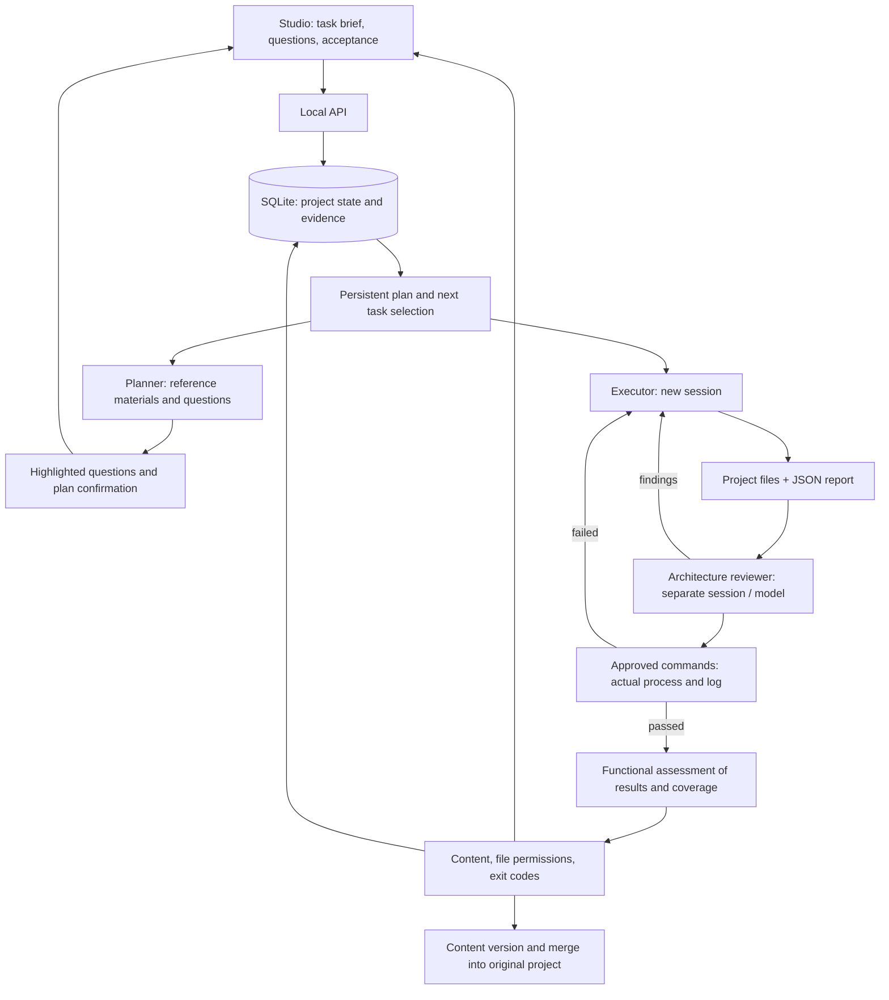

# Long-Term AI Projects — Build Company

Status: Implemented experimental mode in Studio. Weekly continuous operation and reliable delivery of a comprehensive product on a local model are not yet verified.

For product management even after acceptance, use [Products](PRODUCT_LIFECYCLE.md).
Each AI Project is a single execution; the product retains additional requirements,
accepted versions, and maintenance intervals.

## Usage

1. Select a project folder and open **AI Projects → New Long-Term Project**.
2. Describe the target product, reference materials, and constraints. Provide verifiable criteria, one per line.
3. Select a model for planning/execution and a model for review. They may be identical; review always gets a new session.
4. Set project duration, total number of runs, minutes and steps per run. Auto-approval is disabled by default. Without it, tasks wait for tool approval via **Run / Tool Approval**.
5. Use **Save Task Brief**, then **Start Preparation**. Saving alone does not trigger the model.
6. The planner reviews reference materials, proposes tasks, and raises any questions. Questions are highlighted, and answers are saved. After answering them, confirm the plan.
7. The controller executes tasks, triggers independent reviews, and returns findings to the author. At the end, it verifies the entire product’s criteria.
8. After review, Studio automatically runs pre-approved control commands. The status **Product Ready for Acceptance** requires actual success of these processes and unchanged source files. Without commands, the status **Missing Independent Checks** offers adding them or explicit manual acceptance without automatic verification.
9. **Accept Product** re-verifies file contents and permissions, saves a recoverable version, and merges it into the original project; newer conflicting edits are rejected. **Re-verify** triggers another final review.

Paused or blocked execution allows changing models and limits for subsequent runs.
First, the active worker must finish. Saving settings does not resume work,
does not change the overall deadline, and remains in the decision history.

Closing the browser does not stop execution. Studio and the computer must remain running. A model on a remote server does not replace the controller on this machine.

## What Is Implemented

- SQLite with transactional writes, WAL, and connection closing: task brief, plan, dependencies, questions, answers, attempts, and accepted reports.
- Queue of sequential tasks and one active worker for the entire Studio. A regular task and a long-term project cannot simultaneously occupy the same slot.
- Blocking a specific task pauses its dependencies; independent work can continue. In full blocking, empty model cycles are not started.
- Models for execution and review are selected separately. No automatic switch to another provider.
- New executions work in a separate copy of the sources by default. Workers of this execution share its folder; the button **Open Working Version in Editor** opens it in Studio. The original project changes only upon acceptance. `/workspace` is an alias for file tools; the shell uses the physical working folder and relative paths.
- The native planner has limited tools: reading and writing its own report only; it must not perform execution before plan confirmation. Tool phase rules are supplemented by Linux bubblewrap isolation. OAuth/Codex execution is currently disabled pending an isolated credential broker.
- The report must be a real JSON file. The controller checks structure, dependencies, existence of product files, SHA-256, and coverage of criteria. Binary artifacts are supported up to 50 MB per file; text reports up to 2 MB.
- New review session for each task and final model-based product assessment. Model reports are separate from actual exit codes and logs of the independent executor. Successful tests do not prove general product correctness.
- Fixes after review: at most three failed rounds before blocking. Repeated faulty reports or operational errors incur delays and stop after three attempts.
- Time limits per run and per project, run count limits, and operational log limits (128 MB/run, 1 GB/project). These are not limits on total product file size or monetary budget.
- Pause, resume, and termination preserve existing files and history.
- Before starting the worker, the attempt reservation and process identity are saved. The worker waits for write confirmation. On restart, recorded workers are cleaned up by PID and creation time, and interrupted attempts are resumed as new sessions with instructions to first verify files.
- Process recording is refreshed every second. This manages ordinary child processes, not intentionally escaping programs.

## Architecture



Controller data: `.switch-agent/studio/projects.sqlite3`.

Reports in working projects: `company/projects/<ai-project>/reports/<attempt>.json`. Their accepted form and checksums are also stored in the database. Content versions store sources up to 50 MB/file, 500 MB, and 20,000 files; exclude `.env*`, `.git`, dependencies, cache, and operational metadata. They do not replace environment and data backups. Details: [loop, evidence, and deployment](CONTROL_LOOP.md).

On restart, the controller processes completed reports or limited re-execution of interrupted attempts. Recovery does not guarantee exactly one execution of any external action; payments, message sending, and deployment are therefore not part of the automatic delivery in this mode.

## Internet and Reference Materials

Public reference materials may be looked up by the model using available tools. Native `web_search` requires a configured `SERPER_API_KEY`. The GUI shows whether the configuration is present without revealing the key; this is not a live search test. `web_fetch` can directly load provided URLs. Without search, supply links or complete its configuration. Private reference materials, business decisions, and permissions must be provided by the owner; secrets do not belong in the task brief.

## Background Operation

```sh
./switch-studio --no-open
# Optional macOS user service:
./switch-studio-service enable
./switch-studio-service status
./switch-studio-service disable
```

The macOS service uses launchd, starts on login, and restarts the controller on crash. It does not allow public network access. On this Mac, attempting to run the service hit a system restriction on accessing the Documents folder; registration was removed and Studio was restarted normally. macOS protections were not altered. The installer now verifies the service response and removes registration on failure.

For actual weekly operation, choose and set up a permanently available host. Use a Linux backend that does not sleep; a user systemd service with `Restart=on-failure` and running `switch-studio --no-open` is suitable. Remote access can be handled via an SSH tunnel to loopback port 4317. Cloud model logins and configurations must be verified in the service environment.

## What Is Verified and What Is Not Yet

- Automated tests: plan, questions, independent tasks, separate review, fixes, restart, faulty reports, file changes, limits, safe paths, and process identities.
- Integration test: four real Frontier processes via deterministic local model API, file write to project, reading by reviewer, and acceptance. Planning attempt to write via shell is rejected.
- GUI: display of saved project, form with models and limits, work status, and history.
- Live pilots revealed report errors, working path issues, and search under ignored folders. Fixes are covered by regression tests. The current state of real model runs is in the development copy at `analysis/audit/OVERNIGHT_IMPLEMENTATION.md`; completion cannot be inferred from test API.
- A test with accelerated time verifies the seven-day limit; **it does not replace a seven-day operational test**.
- Remaining: verifying longer real-world delivery, network interruptions, and re-login after long operation. Extending to parallel isolation, conflict graphs between sources, and sandboxed workers is future work.

Comparison with the publicly described Apodex product is in [APODEX_COMPARISON.md](APODEX_COMPARISON.md).
