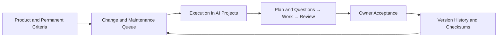

# Products: From Initial Task Brief to Ongoing Maintenance

Status as of 2026-09-23: Experimental digital product management implemented on top of the existing AI Projects controller. One product can have multiple sequential executions, a change queue, and a history of accepted versions. This is not a universal capability to produce any arbitrary product or automatically operate an entire company.

## Usage

1. Open the workspace folder and select **Products → New Product**.
2. Describe the purpose, users, permanent criteria, reference materials, and constraints. Select a model for work and review, and set limits for this specific execution. Choose a type: web, service/API, automation, data, content/documentation, or custom digital product. The type serves as context for the model, not as a pre-installed tech stack or a guarantee of the outcome.
3. **Create Product** only saves the card and the request for the first version. **Start Execution** creates the associated project and initiates its planning.
4. **Open Execution** navigates to existing AI Projects: questions, plan, workers, approval, independent review, and acceptance.
5. Once you accept the result, it appears under **Accepted Versions**. Add further fixes, features, or maintenance. A new execution must satisfy both permanent criteria and change-specific criteria.

For an older accepted project, use **Continue Managing as Product**. Reconnecting re-verifies its files; it is not allowed to attach an unaccepted, modified, or already attached project.

## Automatic Sequencing

By default, this feature is disabled. After explicit activation, the controller runs the queue based on priority (1 = highest), always processing the first version before subsequent changes. It confirms plans that have no open questions. It does not assume ownership responsibility for missing decisions.

Tool approval is a separate option during product creation. If automatic approval is disabled, running tasks on it continue to wait. Default acceptance of each version remains with the owner. In local deployment settings, automatic acceptance and deployment can be enabled separately: in this case, autopilot accepts only versions with successful independent checks.

Blocked and paused tasks do not automatically resume. **Pause Product** stops automatic sequencing and requests stopping the active execution. Before resuming, the parent product must be active. Pausing management itself does not stop an already deployed service; a separate button is required for that.

The overall execution limit ranges from 1 to 100, with a default of 10. Each execution has its own limits for days, attempts, minutes, and steps. Once the overall limit is exhausted, further work will not start until the owner changes the limit. Limits do not represent a monetary budget. Studio still shares a single active worker slot across all products, projects, and one-off tasks.

## Scheduled Maintenance

An interval of 0 means disabled; it can be set to 1–30 days. From the first accepted version, the controller remembers the due date. Upon reaching it, it compares stored checksums and prepares one maintenance request: review the product, perform available checks, fix confirmed defects within scope, and save a report. Without automatic sequencing, the request remains in the queue.

An open execution defers maintenance. An outage or sleep state does not cause a flood of catch-up tasks. An existing open maintenance request is not duplicated; upon restart, the saved due date is read. A newly accepted version shifts the due date from its acceptance time.

**Verify Files of Latest Version** checks local files of the most recent accepted version. A file change may be intentional; the check itself does not flag it as an error nor revert it. This is not a monitoring tool for the availability of a deployed web service. Studio and the host must remain running for scheduled tasks to execute.

## Data and Boundaries

Products use the `products` table in the same `projects.sqlite3` database as AI Projects. Creation of an associated execution and its reservation in the queue are written in a single transaction. The new table does not remove original projects or their history. Each version includes a reference to the execution, criteria and checks from the report, files, and SHA-256. New versions additionally store the content and permissions of source files and a reference to independent checks. **Preview Restore of This Version** shows changes; restoration checks the revision and first saves the previous state. `.env`, dependencies, and runtime data are not included in restoration. File and folder swapping requires manual transfer. Old records containing only hashes do not retroactively retrieve content. For code history, Git remains appropriate.

Project knowledge continues to reside in `PROJECT.md` and related Markdown files. SQLite stores operational state, not a new copy of the knowledge map.

Local deployment now runs the approved service command on loopback, verifies HTTP, stores incidents, and optionally forwards them to the fix queue. A new process replaces the old one only after two successful checks. An older verified version can be redeployed; automatic rollback of data or public hosting is not provided. [Operational Procedure](CONTROL_LOOP.md). Management of remote production infrastructure, CRM, payments, or sending communications is not connected via this extension. A physical product may receive digital reference materials, but not confirmation of actual manufacturing. Weekly operation and quality of complex deliveries on real models remain unverified.

## Verification

- Tests: two versions, preservation of original criteria and history, rejection of modified results, restart, maintenance interval, execution limit, questions, pause, and transaction rollback on save error.
- Integration: first delivery and subsequent change across eight real Frontier processes against a deterministic model API, writing `OK` → `OK-v2`, and two acceptances. It needs Linux with bubblewrap and is skipped on macOS.
- Frontend: filled-out forms, delayed responses, concurrent changes, and workspace folder changes.
- The live model was not verified by this test. A detailed record is in the development copy: `analysis/product-lifecycle-validation.json`.
