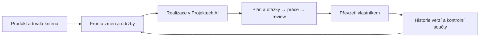

# Produkty: od prvního zadání k další údržbě

Stav 2026-09-23: implementovaná experimentální správa digitálních produktů nad
stávajícím řadičem Projektů AI. Jeden produkt může mít více postupných realizací,
frontu změn a historii převzatých verzí. Nejde o univerzální schopnost vyrobit
libovolný produkt nebo automaticky provozovat celou firmu.

## Použití

1. Otevři pracovní složku, zvol **Produkty → Nový produkt**.
2. Popiš účel, uživatele, trvalá kritéria, podklady a omezení. Vyber model pro práci
   a review a limity jednotlivé realizace. Vyber typ: web, služba/API, automatizace,
   data, obsah/dokumentace nebo vlastní digitální produkt. Typ je kontext pro model,
   nikoli předinstalovaný technologický stack nebo garance výsledku.
3. **Založit produkt** pouze uloží kartu a požadavek na první verzi. **Spustit realizaci**
   založí navázaný projekt a spustí jeho plánování.
4. **Otevřít realizaci** vede do existujících Projektů AI: otázky, plán, pracovníci,
   schvalování, samostatná kontrola a převzetí.
5. Až převezmeš výsledek, objeví se ve **Převzatých verzích**. Přidej další opravu,
   funkci nebo údržbu. Nová realizace musí splnit trvalá kritéria i kritéria změny.

U staršího převzatého projektu použij **Dál spravovat jako produkt**. Připojení znovu
ověří jeho soubory; není dovoleno připojit nepřevzatý, změněný nebo již připojený projekt.

## Automatické navazování

Ve výchozím stavu je vypnuté. Po explicitním zapnutí řadič spouští frontu podle
priority (1 nejvyšší), první verzi vždy před následnými změnami. Potvrzuje plány,
které nemají otevřené otázky. Neodpovídá za vlastníka na chybějící rozhodnutí.

Schvalování nástrojů je samostatná volba při založení produktu. Pokud není povolené
automaticky, běžící úlohy na něj dál čekají. Výchozí převzetí každé verze zůstává na vlastníkovi.
V nastavení místního nasazení lze zvlášť zapnout automatické převzetí a nasazení:
potom autopilot přijme pouze verzi s úspěšnými nezávislými kontrolami.
Blokované a pozastavené úlohy se
automaticky neobnovují. **Pozastavit produkt** zastaví automatické navazování a požádá
o zastavení aktivní realizace. Před jejím obnovením musí být aktivní i nadřazený produkt.
Pozastavení správy samo nezastavuje už nasazenou službu; k tomu je samostatné tlačítko.

Celkový limit realizací má rozsah 1–100, výchozí 10. Každá realizace má vlastní limit
dní, pokusů, minut a kroků. Po vyčerpání celkového limitu se další práce nespustí,
dokud vlastník limit nezmění. Limity nevyjadřují peněžní rozpočet. Studio stále sdílí
jeden aktivní slot pracovníka mezi všemi produkty, projekty i jednorázovými úlohami.

## Pravidelná údržba

Interval 0 znamená vypnuto; lze nastavit 1–30 dní. Od první převzaté verze si řadič
pamatuje termín. Po jeho dosažení porovná uložené kontrolní součty a připraví jeden
požadavek údržby: prohlédnout produkt, provést dostupné kontroly, opravit potvrzené
vady v rozsahu a uložit report. Bez automatického navazování požadavek zůstane ve frontě.

Otevřená realizace údržbu odloží. Výpadek nebo uspání nevytvoří záplavu doháněných
úkolů. Existující otevřený požadavek údržby se nezdvojuje; po restartu se čte uložený
termín. Nově převzatá verze posune termín od svého převzetí.

**Ověřit soubory poslední verze** kontroluje lokální soubory posledního převzetí.
Změna souboru může být záměrná; kontrola sama ji neoznačuje za chybu ani ji nevrací.
Není to monitoring dostupnosti nasazeného webu nebo služby. Studio a hostitel musejí
zůstat spuštěné, aby plánované úlohy běžely.

## Data a hranice

Produkty používají tabulku `products` ve stejné `projects.sqlite3` jako Projekty AI.
Vznik navázané realizace a její rezervace ve frontě se zapisují v jedné transakci.
Nová tabulka neodstraňuje původní projekty ani historii. Verze obsahuje odkaz na
realizaci, kritéria a kontroly z reportu, soubory a SHA-256. Nové verze navíc ukládají
obsah i práva zdrojových souborů a odkaz na nezávislé kontroly. **Náhled obnovy této verze**
ukáže změny; obnova kontroluje revizi a nejdřív uloží předchozí stav. `.env`, závislosti
a provozní data nejsou v obnově. Záměna souboru a složky vyžaduje ruční přesun.
Staré záznamy pouze s hashi nezískají obsah zpětně. Pro historii kódu je dál vhodný Git.

Projektové znalosti dál patří do `PROJECT.md` a souvisejících Markdown souborů.
SQLite uchovává provozní stav, nikoli novou kopii znalostní mapy.

Místní nasazení nyní spouští schválený příkaz služby na loopbacku, ověřuje HTTP,
ukládá incidenty a volitelně je předává do fronty oprav. Nový proces nahradí starý
až po dvou úspěšných kontrolách. Starší ověřenou verzi lze znovu nasadit; není zde
automatický rollback dat ani veřejný hosting. [Provozní postup](CONTROL_LOOP.md).
Správa vzdálené produkční infrastruktury, CRM, platby ani odesílání komunikace
nejsou tímto rozšířením připojené. Fyzický
produkt může dostat digitální podklady, ne potvrzení skutečné výroby. Týdenní provoz
a kvalita složitých dodávek na reálných modelech zůstávají neověřené.

## Ověření

- Testy: dvě verze, zachování původních kritérií a historie, odmítnutí změněného
  výsledku, restart, interval údržby, limit realizací, otázky, pozastavení a rollback
  transakce při chybě uložení.
- Integrace: první dodávka a následná změna přes osm skutečných procesů Frontieru
  proti deterministickému modelovému API, zápis `OK` → `OK-v2` a dvě převzetí.
- Frontend: rozepsané formuláře, opožděné odpovědi, souběh změn a změna pracovní složky.
- Živý model tímto testem ověřen nebyl. Podrobný záznam ve vývojové kopii:
  `analysis/product-lifecycle-validation.json`.
