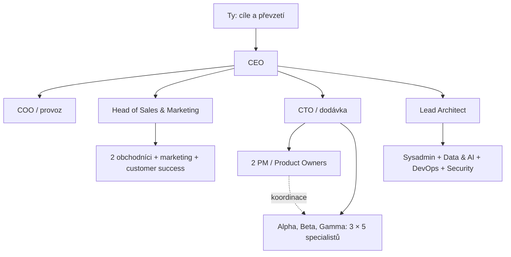

# AI Build Company

Opakovaně použitelná šablona organizace pro Switch Studio. Obsahuje 30 AI rolí, jejich instrukce, odpovědnosti, výstupy, nadřízené a reviewery. Člověk je vlastníkem a není započítaný mezi AI role.

## Použití ve Studiu

1. Vyber projekt a otevři **Šablony** v horní liště.
2. Rozklikni jednotlivé role a použij **Uložit do projektu**. Vznikne `company/ai-build-company.json` ve vybraném projektu. Existující soubor se nepřepisuje.
3. Přes **Otevřít soubor** uprav `project_brief`: cíl, rozsah, cílové soubory, akceptační kritéria a omezení. Změny ulož pomocí Cmd/Ctrl+S. Role i jejich instrukce můžeš upravit ve stejné kopii.
4. Použij **Přidat k zadání** a doplň konkrétní práci. Stávající text zadání zůstává zachovaný. Šablonu přidej znovu pro každou novou úlohu, která ji má používat.
5. Vyber model a režim a spusť úlohu. Samotné uložení šablony ani přidání instrukcí nic nespouští.

Dialog vždy ukazuje výchozí šablonu. Autoritativní pro konkrétní projekt je jeho uložený JSON, který agent dostane pokyn přečíst. Šablona je přenositelná i do jiného agentního prostředí: zkopíruj JSON a odkaž na něj v zadání.

## Organizace

| Oddělení | Role | Počet |
|---|---|---:|
| Vedení a provoz | CEO, COO / Office Manager | 2 |
| Obchod a marketing | Head of Sales & Marketing, 2 Account Executives, Marketing, Customer Success | 5 |
| Vývoj a dodávka | CTO, 2 PM / Product Owners, 3 týmy po 5 specialistech | 18 |
| Interní IT, data a AI | Lead Architect, Sysadmin, Data & AI, DevOps, Security | 5 |
| Celkem | | **30** |

Každý vývojový tým (Alpha, Beta, Gamma) má frontend, backend, fullstack, QA a UX. Specialisté se zodpovídají přímo CTO; PM koordinuje úkoly, netvoří čtvrtou řídicí vrstvu. Vedoucí také vykonávají odbornou práci. Personální agendu zajišťuje COO společně s vedoucími. DevOps a Security doplňují dvě chybějící pozice v původním pětičlenném IT oddělení. Externí účetnictví, právo a kreativní služby jsou mimo počet 30.

Postup dodávky je **zadání → technický plán → realizace → nezávislá kontrola → převzetí**. Předávací report obsahuje konkrétní cesty k výstupům, provedené kontroly, výsledky a omezení. Autor sám nepotvrzuje přijetí své práce. Pro první ověření použij jeden malý úkol s rolemi CTO, PM, fullstack a QA.

## Co šablona skutečně aktivuje

Vícedenní dodávku produktu, zvýrazněné vstupní otázky a dohledávání podkladů řeší samostatný experimentální režim **Projekty AI**. Viz [návod a aktuální omezení](../docs/LONG_RUNNING_PROJECTS.md). Šablona ho sama nespouští a týdenní provoz zatím není ověřený.

Je to organizační předloha a sada instrukcí. **Nevytváří automaticky 30 běžících agentů ani nevynucuje oprávnění.** Model i režim vybíráš pro konkrétní běh. Vnořené týmy a modely přiřazené všem jednotlivým rolím vyžadují další implementaci. Samostatný režim Projekty AI už má cyklus realizátor/reviewer s volbou dvou profilů; jeho provozní ověření popisuje odkazovaný návod.

Pole `preferred_model`, `model_preferences` a `execution_policy` vyjadřují preference předlohy; nepřepisují profily Studia ani provozní limity. Cloudový fallback je v předloze vypnutý. Šablona sama nepotřebuje cloud, OAuth ani klíče. `project_brief.approved_external_actions` slouží pro záznam konkrétních rozhodnutí vlastníka, nikoli jako technické oprávnění k akcím.
