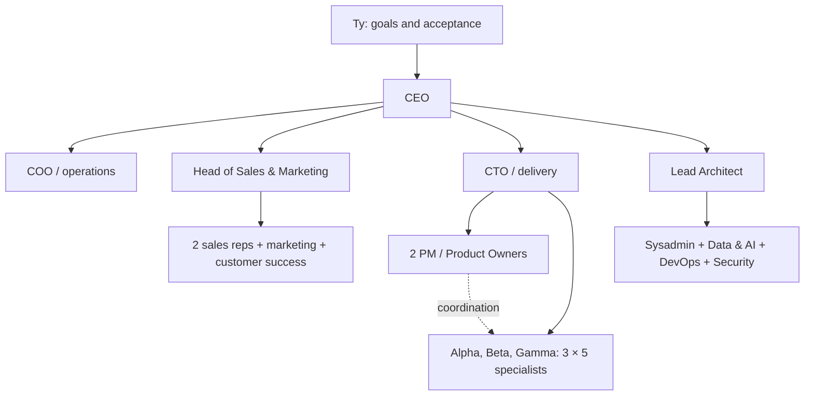

# AI Build Company

A reusable organizational template for Switch Studio. It includes 30 AI roles, their instructions, responsibilities, outputs, managers, and reviewers. The human owner is not counted among the AI roles.

## Usage in Studio

1. Select a project and open **Templates** in the top bar.
2. Expand individual roles and use **Save to Project**. This creates `company/ai-build-company.json` in the selected project. Existing files are not overwritten.
3. Use **Open File** to edit `project_brief`: goal, scope, target files, acceptance criteria, and constraints. Save changes using Cmd/Ctrl+S. You can also edit roles and their instructions in the same copy.
4. Use **Add to Task Brief** to add specific work. Existing task brief text is preserved. Add the template again for each new task that should use it.
5. Select a model and mode, then start the task. Saving the template or adding instructions alone does not trigger anything.

The dialog always shows the default template. The authoritative source for a specific project is its saved JSON, which the agent is instructed to read. The template is portable to other agent environments: copy the JSON and reference it in the task brief.

## Organization

| Department | Roles | Count |
|---|---|---:|
| Leadership & Operations | CEO, COO / Office Manager | 2 |
| Sales & Marketing | Head of Sales & Marketing, 2 Account Executives, Marketing, Customer Success | 5 |
| Development & Delivery | CTO, 2 PM / Product Owners, 3 teams of 5 specialists each | 18 |
| Internal IT, Data & AI | Lead Architect, Sysadmin, Data & AI, DevOps, Security | 5 |
| Total | | **30** |

Each development team (Alpha, Beta, Gamma) includes frontend, backend, fullstack, QA, and UX. Specialists report directly to the CTO; the PM coordinates tasks but does not form a fourth management layer. Managers also perform hands-on work. HR matters are handled by the COO together with team leads. DevOps and Security fill two missing positions in the original five-person IT department. External accounting, legal, and creative services are outside the count of 30.

The delivery process is **task brief → technical plan → execution → independent review → acceptance**. The handover report includes specific paths to outputs, performed checks, results, and limitations. The author does not confirm acceptance of their own work. For the first verification, use one small task involving roles CTO, PM, fullstack, and QA.

## What the Template Actually Activates

Multi-day product delivery, highlighting of input questions, and background research are handled by a separate experimental mode: **AI Projects**. See [guide and current limitations](../docs/LONG_RUNNING_PROJECTS.md). The template itself does not trigger this mode, and week-long operation is not yet verified.

It is an organizational template and set of instructions. **It does not automatically create 30 running agents nor enforce permissions.** You choose the model and mode for each specific run. Nested teams and models assigned to individual roles require further implementation. The separate AI Projects mode already has a worker/reviewer cycle with a choice of two profiles; its operational verification is described in the linked guide.

Fields `preferred_model`, `model_preferences`, and `execution_policy` express template preferences; they do not override Studio profiles or operational limits. Cloud fallback is disabled in the template. The template itself does not require cloud, OAuth, or keys. `project_brief.approved_external_actions` is for recording specific owner decisions, not as technical authorization for actions.
